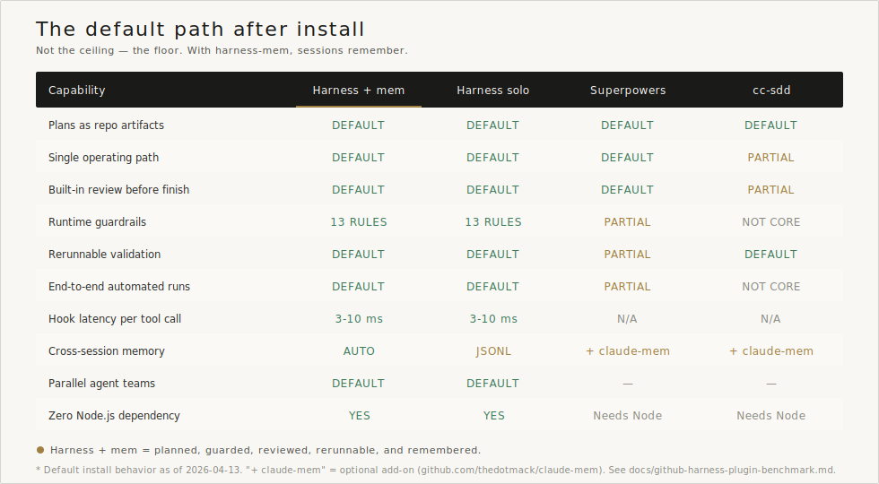
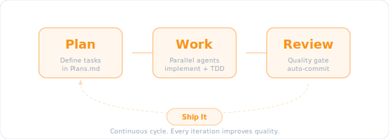

<p align="center">
  
</p>

<p align="center">
  <strong>Plan. Work. Review. Ship.</strong><br>
  <em>Turn Claude Code into a disciplined development partner.</em>
</p>

<p align="center">
  <a href="https://github.com/Chachamaru127/claude-code-harness/releases/latest"></a>
  <a href="LICENSE.md"></a>
  <a href="docs/CLAUDE_CODE_COMPATIBILITY.md"></a>
  
  
</p>

<p align="center">
  English | <a href="README_ja.md">日本語</a>
</p>

---

## Why Harness?

Claude Code is powerful. Harness turns that raw capability into a delivery loop that is easier to trust and harder to derail.

<p align="center">
  
</p>

The 5 verb skills keep setup, plan, work, review, and release on one path. The TypeScript guardrail engine protects execution, and validation can be rerun when you need proof.

## Compared With Popular Claude Code Harnesses

What matters here is not the theoretical ceiling of Claude Code. It is what becomes the **default operating model** once you install a harness.

This is a **user-facing workflow** snapshot as of **2026-03-06**, not a popularity contest.
Full notes and source links: [docs/github-harness-plugin-benchmark.md](docs/github-harness-plugin-benchmark.md)

The card below focuses on what becomes the default operating path after install.

<p align="center">
  
</p>

Claude Harness is the clearest fit if you want the default path itself to stay planned, guarded, reviewed, and rerunnable.

Supported baseline and latest verified snapshot: see [Claude Code Compatibility](docs/CLAUDE_CODE_COMPATIBILITY.md).

---

## Requirements

- **Claude Code v2.1+** ([Install Guide](https://docs.anthropic.com/claude-code))
- **Node.js 18+** (for TypeScript core engine & safety hooks)

---

## Install in 30 Seconds

```bash
# Start Claude Code in your project
claude

# Add the marketplace & install
/plugin marketplace add Chachamaru127/claude-code-harness
/plugin install claude-code-harness@claude-code-harness-marketplace

# Initialize your project
/harness-setup
```

That's it. Start with `/harness-plan`.

---

## 🪄 TL;DR: Verified Work All

**Don't want to read all this?** Just type:

```
/harness-work all
```

**One command runs the full loop after plan approval.** Plan → Parallel Implementation → Review → Commit.

<p align="center">
  
</p>

> ⚠️ **Experimental workflow**: Once you approve the plan, Claude runs to completion. Validate the success/failure contract in [docs/evidence/work-all.md](docs/evidence/work-all.md) before depending on it in production.

---

## The 5 Verb Workflow

<p align="center">
  
</p>

### 0. Setup

```bash
/harness-setup
```

Bootstraps project files, rules, and command surfaces so the rest of the loop runs against the same conventions.

### 1. Plan

```bash
/harness-plan
```

> "I want a login form with email validation"

Harness creates `Plans.md` with clear acceptance criteria.

### 2. Work

```bash
/harness-work              # Auto-detect parallelism
/harness-work --parallel 5 # 5 workers simultaneously
```

Each worker implements, runs a preflight self-check, and waits for an independent review verdict before completion.

<p align="center">
  
</p>

### 3. Review

```bash
/harness-review
```

<p align="center">
  
</p>

| Perspective | Focus |
|-------------|-------|
| Security | Vulnerabilities, injection, auth |
| Performance | Bottlenecks, memory, scaling |
| Quality | Patterns, naming, maintainability |
| Accessibility | WCAG compliance, screen readers |

### 4. Release

```bash
/harness-release
```

Packages the verified result into CHANGELOG, tag, and release handoff steps after implementation and review are complete.

---

## Safety First

<p align="center">
  
</p>

Harness v3 protects your codebase with a **TypeScript guardrail engine** (`core/`) — 13 declarative rules (R01–R13), compiled and type-checked:

| Rule | Protected | Action |
|------|-----------|--------|
| R01 | `sudo` commands | **Deny** |
| R02 | `.git/`, `.env`, secrets | **Deny** write |
| R03 | Shell writes to protected files | **Deny** |
| R04 | Writes outside project | **Ask** |
| R05 | `rm -rf` | **Ask** |
| R06 | `git push --force` | **Deny** |
| R07–R09 | Mode-specific and secret-read guards | Context-aware |
| R10 | `--no-verify`, `--no-gpg-sign` | **Deny** |
| R11 | `git reset --hard main/master` | **Deny** |
| R12 | Direct push to `main` / `master` | **Warn** |
| R13 | Protected file edits | **Warn** |
| Post | `it.skip`, assertion tampering | **Warning** |
| Perm | `git status`, `npm test` | **Auto-allow** |

Runtime differences between Claude Code hooks and Codex CLI gates are documented in [docs/hardening-parity.md](docs/hardening-parity.md).

---

## 5 Verb Skills, Zero Config

v3 unifies 42 skills into **5 verb skills**. Start with the verbs first, then add Breezing, Codex, or 2-agent flows only when you need them.

<table>
<tr>
<td align="center" width="20%"><h3>/plan</h3>Ideas → Plans.md</td>
<td align="center" width="20%"><h3>/work</h3>Parallel implementation</td>
<td align="center" width="20%"><h3>/review</h3>4-angle code review</td>
<td align="center" width="20%"><h3>/release</h3>Tag + GitHub Release</td>
<td align="center" width="20%"><h3>/setup</h3>Project init & config</td>
</tr>
</table>

<p align="center">
  
</p>

### Key Commands

| Command | What It Does | Legacy Redirect |
|---------|--------------|-----------------|
| `/harness-plan` | Ideas → `Plans.md` | `/plan-with-agent`, `/planning` |
| `/harness-work` | Parallel implementation | `/work`, `/breezing`, `/impl` |
| `/harness-work all` | Approved plan → implement → review → commit | `/work all` |
| `/harness-review` | 4-perspective code review | `/harness-review`, `/verify` |
| `/harness-release` | CHANGELOG, tag, GitHub Release | `/release-har`, `/handoff` |
| `/harness-setup` | Initialize project | `/harness-init`, `/setup` |
| `/memory` | Manage SSOT files | — |

---

## Who Is This For?

| You Are | Harness Helps You |
|---------|-------------------|
| **Developer** | Ship faster with built-in QA |
| **Freelancer** | Deliver review reports to clients |
| **Indie Hacker** | Move fast without breaking things |
| **VibeCoder** | Build apps with natural language |
| **Team Lead** | Enforce standards across projects |

---

## Architecture

```
claude-code-harness/
├── core/           # TypeScript guardrail engine (strict ESM, NodeNext)
│   └── src/        #   guardrails/ state/ engine/
├── skills-v3/      # 5 verb skills (plan/execute/review/release/setup)
├── agents-v3/      # 3 agents (worker/reviewer/scaffolder)
├── hooks/          # Thin shims → core/ engine
├── skills/         # 41 legacy skills (retained for compatibility)
├── agents/         # 11 legacy agents (retained for compatibility)
├── scripts/        # v2 hook scripts (coexist with v3 core)
└── templates/      # Generation templates
```

---

## Advanced Features

<details>
<summary><strong>Breezing (Agent Teams)</strong></summary>

Run entire task lists with autonomous agent teams:

```bash
/harness-work breezing all                    # Plan review + parallel implementation
/harness-work breezing --no-discuss all       # Skip plan review, go straight to coding
/harness-work breezing --codex all            # Delegate to Codex engine
```

<p align="center">
  
</p>

**Phase 0 (Planning Discussion)** runs by default—Planner analyzes task quality, Critic challenges the plan, then you approve before coding starts.

| Feature | Description |
|---------|-------------|
| Planning Discussion | Planner + Critic review your plan (default-on) |
| Task Validation (V1–V5) | Scope, ambiguity, overlap, dependency, TDD checks |
| Progressive Batching | 8+ tasks auto-split into manageable batches |
| Hook-driven Signals | Auto-triggers for partial review and next batch |

> **Cost**: ~5.5x tokens (default) vs ~4x (with `--no-discuss`). The plan review pays for itself by reducing rework.

</details>

<details>
<summary><strong>Codex Engine</strong></summary>

Delegate implementation tasks to OpenAI Codex in parallel:

```bash
/harness-work --codex implement these 5 API endpoints
```

Codex implements → Self-reviews → Reports back. Works alongside Claude Code workers.

> **Setup required**: Install [Codex CLI](https://github.com/openai/codex) and configure API key.

</details>

<details>
<summary><strong>Codex CLI Setup</strong></summary>

Use Harness with [Codex CLI](https://github.com/openai/codex) — no Claude Code required.

**Prerequisites**: [Codex CLI](https://github.com/openai/codex) (`npm i -g @openai/codex`), OpenAI API key (`OPENAI_API_KEY`), Git.

```bash
# 1. Clone the Harness repository
git clone https://github.com/Chachamaru127/claude-code-harness.git
cd claude-code-harness

# 2. Install skills/rules to user scope (~/.codex)
./scripts/setup-codex.sh --user

# 3. Go to your project and start working
cd /path/to/your-project
codex
```

Once inside Codex, use `$harness-plan`, `$harness-work`, `$breezing`, and `$harness-review`.

| Flag | Description |
|------|-------------|
| `--user` | Install to `~/.codex` (shared across projects, default) |
| `--project` | Install to `.codex/` in current directory |

> Claude Code users can run `/setup codex` inside a session instead.

</details>

<details>
<summary><strong>2-Agent Mode (with Cursor)</strong></summary>

Use Cursor as PM, Claude Code as implementer.

```bash
/harness-release handoff  # Report to Cursor PM
```

Plans.md syncs between both.

</details>

<details>
<summary><strong>Codex Review Integration</strong></summary>

Add OpenAI Codex for second opinions:

```bash
/harness-review --codex  # 4 perspectives + Codex CLI
```

Codex selects 4 relevant experts from 16 specialist types via `codex exec`.

</details>

<details>
<summary><strong>Slide Generation</strong></summary>

Generate one-page project intro slides:

```bash
/generate-slide
```

- 3 visual patterns (Minimalist / Infographic / Hero)
- 2 candidates per pattern with quality scoring
- Best 3 slides exported to `out/slides/selected/`

> **Dependencies**: `GOOGLE_AI_API_KEY` and Google AI Studio access.

</details>

<details>
<summary><strong>Video Generation</strong></summary>

Generate product videos with JSON Schema-driven pipeline:

```bash
/generate-video
```

- JSON Schema as SSOT (Single Source of Truth)
- 3-layer validation: scene → scenario → E2E
- Remotion-based rendering with deterministic output

> **Dependencies**: Requires [Remotion](https://www.remotion.dev/) project setup and ffmpeg.

</details>

<details>
<summary><strong>Agent Trace</strong></summary>

Automatically tracks AI-generated code edits:

```
.claude/state/agent-trace.jsonl
```

- Records every Edit/Write operation
- Shows project name, current task, recent edits at session end
- Enables `/sync-status` to compare Plans.md with actual changes

No setup required—enabled by default.

</details>

---

## Why Harness vs Skill-Pack Only?

Skill packs can teach a prompt. Harness also enforces behavior at runtime.

- **Guardrail engine** blocks destructive writes, secret exposure, and force-push patterns on the actual execution path.
- **Hooks + review flow** keep quality checks close to the tools that edit your repo.
- **Validation scripts + evidence pack** give you a rerunnable way to confirm docs, packaging, and `/harness-work all` behavior.

---

## Troubleshooting

| Issue | Solution |
|-------|----------|
| Command not found | Run `/harness-setup` first |
| `harness-*` commands missing on Windows | Update or reinstall the plugin. Public command skills now ship as real directories, so `core.symlinks=false` no longer hides them. |
| Plugin not loading | Clear cache: `rm -rf ~/.claude/plugins/cache/claude-code-harness-marketplace/` and restart |
| Hooks not working | Ensure Node.js 18+ is installed |

For more help, [open an issue](https://github.com/Chachamaru127/claude-code-harness/issues).

---

## Uninstall

```bash
/plugin uninstall claude-code-harness
```

Project files (Plans.md, SSOT files) remain unchanged.

---

## Claude Code 2.1.74+ Features

Harness leverages the latest Claude Code features out of the box.

| Feature | Skill | Purpose |
|---------|-------|---------|
| **Agent Memory** | harness-work, harness-review | Persistent learning across sessions |
| **TeammateIdle/TaskCompleted Hook** | breezing | Automated team monitoring |
| **Worktree isolation** | breezing | Safe parallel writes to the same file |
| **HTTP hooks** | hooks | JSON POST to Slack, dashboards, metrics |
| **Effort levels + ultrathink** | harness-work | Auto-injects ultrathink for complex tasks |
| **Agent hooks** | hooks | LLM-powered code quality guards (secrets, TODO stubs, security) |
| **`${CLAUDE_SKILL_DIR}` variable** | all harness-* skills | Stable references to skill-local docs |
| **`agent_id` / `agent_type` fields** | hooks, breezing | Robust teammate identity and role guard |
| **`{"continue": false}` teammate response** | breezing | Auto-stop when all assigned tasks are complete |
| **`/reload-plugins`** | all harness-* skills | Apply skill/hook edits immediately |
| **`/loop` + Cron scheduling** | breezing, harness-work | Active polling with `/loop 5m /sync-status` |
| **PostToolUseFailure hook** | hooks | Auto-escalation after 3 consecutive tool failures |
| **Background Agent output fix** | breezing | Safe `run_in_background` with output path in completion |
| **Compaction image retention** | all harness-* skills | Images preserved during context compaction |
| **WorktreeCreate/Remove hook** | breezing | Worktree lifecycle auto-setup and cleanup |
| **`modelOverrides` setting** | harness-setup, breezing | Map model picker aliases to Bedrock, Vertex, or other provider-specific model IDs |
| **`autoMemoryDirectory` setting** | session-memory, harness-setup | Store Claude auto-memory in a project-specific path when needed |
| **`CLAUDE_CODE_SESSIONEND_HOOKS_TIMEOUT_MS`** | hooks | Give SessionEnd hooks enough time for cleanup and finalize work |
| **Full model ID support** | agents-v3, breezing | Use `claude-sonnet-4-6` style IDs in agent frontmatter and JSON config |

Full list: [docs/CLAUDE-feature-table.md](docs/CLAUDE-feature-table.md)

---

## Documentation

| Resource | Description |
|----------|-------------|
| [Changelog](CHANGELOG.md) | Version history |
| [Claude Code Compatibility](docs/CLAUDE_CODE_COMPATIBILITY.md) | Requirements |
| [Distribution Scope](docs/distribution-scope.md) | Included vs compatibility vs development-only paths |
| [Work All Evidence Pack](docs/evidence/work-all.md) | Success/failure verification contract |
| [Cursor Integration](docs/CURSOR_INTEGRATION.md) | 2-Agent setup |
| [Benchmark Rubric](docs/benchmark-rubric.md) | Static vs executed evidence scoring |
| [Positioning Notes](docs/positioning-notes.md) | Public-facing differentiation language |
| [Content Layout](docs/content-layout.md) | Source docs vs generated outputs convention |

---

## Contributing

Issues and PRs welcome. See [CONTRIBUTING.md](CONTRIBUTING.md).

---

## Acknowledgments

- [AI Masao](https://note.com/masa_wunder) — Hierarchical skill design
- [Beagle](https://github.com/beagleworks) — Test tampering prevention patterns

---

## License

**MIT License** — Free to use, modify, commercialize.

[English](LICENSE.md) | [日本語](LICENSE.ja.md)
