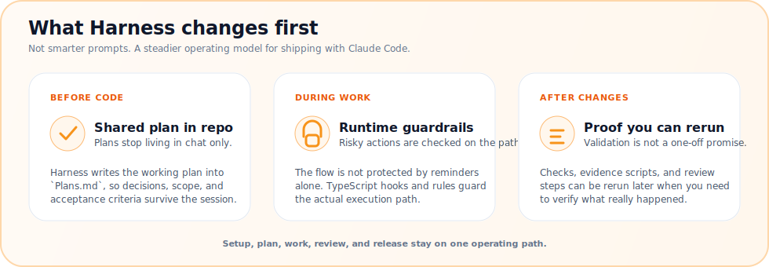
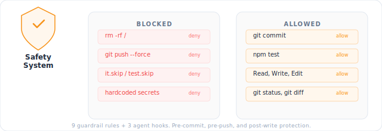

<p align="center">
  <em>Turn Claude Code into a disciplined development partner.</em>
</p>

<p align="center">
  <a href="https://github.com/tim-hub/powerball-harness/releases/latest"></a>
  <a href="LICENSE.md"></a>
  <a href="docs/CLAUDE_CODE_COMPATIBILITY.md"></a>
</p>

A Claude Code plugin for autonomous **Plan → Work → Review** workflows, backed by two Go-native guardrail engines that block dangerous operations and credential leaks at runtime.

<p align="center">
  
</p>

- **`Plans.md` drives the work** — every task has acceptance criteria; agents follow the plan instead of improvising
- **Two Go-native guardrails** — operation guard (`R01–R13`) blocks dangerous tool calls; content guard (PII Guard) blocks credential leaks
- **Memory persists** — decisions, patterns, and per-task execution traces survive across sessions

---

## Installation

**Requirements**: Claude Code v2.1+ · Go 1.22+ runtime

```bash
# Run inside Claude Code (user scope recommended — applies across all your projects)
/plugin marketplace add tim-hub/powerball-harness
/plugin install harness@powerball-harness-marketplace --scope user
```

> First-time setup only: run `/harness-setup` to create `CLAUDE.md`, `Plans.md`, `.claude/memory`. Existing projects with these files can skip it.

---

## Core Skills

| Command | What it does |
|---------|-------------|
| `/harness-setup` | Project initialization (creates `CLAUDE.md` and `Plans.md`) |
| `/harness-plan` | Ideas → `Plans.md` with acceptance criteria |
| `/harness-work` | Implementation — auto-selects solo (1 task) / parallel (2–3) / breezing (4+) |
| `/harness-review` | 4-perspective code review (security, performance, quality, a11y) |
| `/harness-release` | CHANGELOG, tag, and GitHub Release |
| `/harness-remember` | SSOT — decisions, patterns, session logs |
| `/harness-loop` | Runs Plans.md tasks in a long-running autonomous loop |

Run everything after plan approval:

```bash
/harness-work all
```

Or even more automated:
```bash
/harness-loop all
```


Full skill catalog, lifecycle diagrams, and agent roles: [harness/README.md](harness/README.md).

---

## Go Guardrails

<p align="center">
  
</p>

13 declarative rules in [`go/internal/guardrail/`](go/internal/guardrail/), evaluated in priority order on every tool call:

| Rule | Protected | Action |
|------|-----------|--------|
| R01 | `sudo` commands | **Deny** |
| R02 | `.git/`, `.env`, secrets | **Deny** write |
| R03 | Shell writes to protected files | **Deny** |
| R04 | Writes outside project | **Ask** |
| R05 | `rm -rf` | **Ask** |
| R06 | `git push --force` | **Deny** |
| R07–R09 | Mode-specific and secret-read guards | Context-aware |
| R10 | `--no-verify`, `--no-gpg-sign` | **Deny** |
| R11 | `git reset --hard main/master` | **Deny** |
| R12 | Direct push to `main` / `master` | **Warn** |
| R13 | Protected file edits | **Warn** |
| Post | `it.skip`, assertion tampering | **Warning** |
| Perm | `git status`, `npm test` | **Auto-allow** |

Runtime hook behavior: [docs/hardening-parity.md](docs/hardening-parity.md) · Engine internals: [go/README.md](go/README.md).


### PII & Secret Guard

A second guardrail engine in [`go/internal/piiguard/`](go/internal/piiguard/) — 45 rules (15 built-in + 30 from an embedded coding-only catalog) that block AWS / OpenAI / Anthropic / Google / GitHub / Stripe / HuggingFace API keys, JWT and Bearer tokens, PEM private keys, generic `api_key = "..."` assignments, and email addresses. Wired into three hooks:

| Hook event | Action on detection |
|---|---|
| `UserPromptSubmit` | Hard block (`{decision: "block"}` + exit 1) |
| `PreToolUse` (`Write\|Edit\|MultiEdit\|Bash\|Read`) | `permissionDecision: deny` |
| `PostToolUse` (`Bash\|Read`) | Inject redacted view via `additionalContext` |

Disable globally with `HARNESS_PIIGUARD_DISABLED=1` or per-rule with `HARNESS_PIIGUARD_DISABLED_RULES=id1,id2`.


---

## Other Core Features


### Advisor

A read-only Opus consultation agent that Workers consult on high-risk preflight, repeated failures, or restart plateaus. Returns one of three structured decisions:

- **`PLAN`** — replan using the suggested approach
- **`CORRECTION`** — apply the provided local fix
- **`STOP`** — escalate to Reviewer; human decision required

Full configuration: [docs/advisor-strategy.md](docs/advisor-strategy.md).

### Self-learning Skills (experimental)

Two meta-skills that grow your project's skill set as you work:

**`/distill-session`** — At the end of a session that solved a non-trivial, repeatable problem, this skill reviews what happened, identifies the workflow, drafts a `SKILL.md`, shows you a preview, and writes it to `.claude/skills/<name>/SKILL.md` on approval. Trigger phrases: "save this", "distill this", "turn this into a skill". Checks for an existing overlapping skill first and hands off to `/update-skill` if one is found.

**`/update-skill`** — Refines an existing project skill with new learnings from the current session. Diagnoses whether the fix is a description tightening, a new branch, a correction, or a reference extraction, then proposes a minimal diff. Falls back to `/distill-session` when the new learning is broad enough to warrant a new skill.

### Meta-Harness ([arXiv:2603.28052](https://arxiv.org/abs/2603.28052))

Inspired by *Meta-Harness: End-to-End Optimization of Model Harnesses* — compressed feedback loses causal signal, so agents need raw execution history, not summaries. Drives the per-task `.claude/state/traces/` JSONL system and the `harness-review` eval loop.

### Natural-Language Agent Harnesses ([arXiv:2603.25723](https://arxiv.org/abs/2603.25723))

Inspired by *Natural-Language Agent Harnesses* — named failure modes drive recovery strategies. The Failure Taxonomy (`FT-*` IDs) in [`.claude/rules/failure-taxonomy.md`](.claude/rules/failure-taxonomy.md) is a direct implementation.


---

## Documentation

- [Changelog](CHANGELOG.md)
- [Claude Code Compatibility](docs/CLAUDE_CODE_COMPATIBILITY.md)
- [Guardrail Rules](docs/hardening-parity.md)
- [Advisor Strategy](docs/advisor-strategy.md)
- [Workflow Diagrams · Skill Catalog · Hooks](harness/README.md)

### Troubleshooting

| Issue | Fix |
|---|---|
| Hook errors on every prompt | Run `/harness-setup binary` to re-download the platform binary |
| Commands not found | Run `/harness-setup` first |
| Plugin not loading | `rm -rf ~/.claude/plugins/cache/powerball-harness-marketplace/` and restart |

### Uninstall

```bash
/plugin uninstall powerball-harness
```

Project files (`Plans.md`, `CLAUDE.md`, SSOT files) remain unchanged.

---

## Contributing

- Issues and PRs welcome. See [CONTRIBUTING.md](CONTRIBUTING.md).
- Credits: 
  - [@Chachamaru127](https://github.com/Chachamaru127/claude-code-harness) for the original work of Claude Code harness development.
  - [@datumbrain](https://github.com/datumbrain/claude-privacy-guard) for PII Patterns detection.

## License

MIT — [Full License](LICENSE.md)
