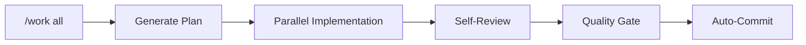

<p align="center">
  
</p>

<p align="center">
  <strong>Plan. Work. Review. Ship.</strong><br>
  <em>Turn Claude Code into a disciplined development partner.</em>
</p>

<p align="center">
  <a href="VERSION"></a>
  <a href="LICENSE.md"></a>
  <a href="docs/CLAUDE_CODE_COMPATIBILITY.md"></a>
  
  
</p>

<p align="center">
  English | <a href="README_ja.md">日本語</a>
</p>

---

## Why Harness?

Claude Code is powerful—but sometimes it needs structure.

| Without Harness | With Harness |
|-----------------|--------------|
| Jumps into code immediately | Plans first, then executes |
| Reviews only when asked | Auto-reviews every change |
| Forgets past decisions | SSOT files preserve context |
| `rm -rf` runs without warning | Dangerous commands blocked |
| One task at a time | Parallel workers |

<p align="center">
  
</p>

**Three commands. One workflow. Production-ready code.**


---

## Requirements

- **Claude Code v2.1+** ([Install Guide](https://docs.anthropic.com/claude-code))
- **Node.js 18+** (for TypeScript core engine & safety hooks)

---

## Install in 30 Seconds

```bash
# Start Claude Code in your project
claude

# Add the marketplace & install
/plugin marketplace add Chachamaru127/claude-code-harness
/plugin install claude-code-harness@claude-code-harness-marketplace

# Initialize your project
/harness-init
```

That's it. Start with `/plan-with-agent`.

---

## 🪄 TL;DR: Work All

**Don't want to read all this?** Just type:

```
/work all
```

**One command. Harness does the rest.** Plan → Parallel Implementation → Review → Commit.



<p align="center">
  
</p>

| Before | After |
|--------|-------|
| `/plan-with-agent` → `/work` → `/harness-review` → `git commit` | `/work all` |
| 4 commands | **1** |

> ⚠️ **Experimental**: Once you approve the plan, Claude runs to completion. Quality gate blocks commit if issues found.

---

## The Core Loop (Details)

### 1. Plan

```bash
/plan-with-agent
```

> "I want a login form with email validation"

Harness creates `Plans.md` with clear acceptance criteria.

### 2. Work

```bash
/work              # Auto-detect parallelism
/work --parallel 5 # 5 workers simultaneously
```

Each worker implements, self-reviews, and reports.

<p align="center">
  
</p>

### 3. Review

```bash
/harness-review
```

| Perspective | Focus |
|-------------|-------|
| Security | Vulnerabilities, injection, auth |
| Performance | Bottlenecks, memory, scaling |
| Quality | Patterns, naming, maintainability |
| Accessibility | WCAG compliance, screen readers |

---

## Safety First

Harness v3 protects your codebase with a **TypeScript guardrail engine** (`core/`) — 9 declarative rules (R01–R09), compiled and type-checked:

| Rule | Protected | Action |
|------|-----------|--------|
| R01 | `sudo` commands | **Deny** |
| R02 | `.git/`, `.env`, secrets | **Deny** write |
| R03 | `rm -rf /`, destructive paths | **Deny** |
| R04 | `git push --force` | **Deny** |
| R05–R09 | Mode-specific guards | Context-aware |
| Post | `it.skip`, assertion tampering | **Warning** |
| Perm | `git status`, `npm test` | **Auto-allow** |

<p align="center">
  
</p>

---

## 5 Verb Skills, Zero Config

v3 unifies 42 skills into **5 verb skills**. Auto-load by context. Slash commands or natural language.

| Verb | What It Does | Legacy Equivalent |
|------|-------------|-------------------|
| `plan` | Ideas → Plans.md | planning, plans-management, sync-status |
| `execute` | Parallel implementation | work, breezing, impl |
| `review` | 4-perspective code review | harness-review, codex-review |
| `release` | CHANGELOG, tag, GitHub Release | release-har, handoff |
| `setup` | Project init & tool config | setup, harness-init |

<p align="center">
  
</p>

### Key Commands

| Command | v3 Verb | What It Does |
|---------|---------|--------------|
| `/plan-with-agent` | plan | Ideas → `Plans.md` |
| `/work` | execute | Parallel implementation |
| `/work all` | execute | Plan → Implement → Review → Commit |
| `/harness-review` | review | 4-perspective code review |
| `/harness-init` | setup | Initialize project |
| `/sync-status` | plan | Check progress |
| `/memory` | — | Manage SSOT files |

---

## Who Is This For?

| You Are | Harness Helps You |
|---------|-------------------|
| **Developer** | Ship faster with built-in QA |
| **Freelancer** | Deliver review reports to clients |
| **Indie Hacker** | Move fast without breaking things |
| **VibeCoder** | Build apps with natural language |
| **Team Lead** | Enforce standards across projects |

---

## Architecture

```
claude-code-harness/
├── core/           # TypeScript guardrail engine (strict ESM, NodeNext)
│   └── src/        #   guardrails/ state/ engine/
├── skills-v3/      # 5 verb skills (plan/execute/review/release/setup)
├── agents-v3/      # 3 agents (worker/reviewer/scaffolder)
├── hooks/          # Thin shims → core/ engine
├── skills/         # 41 legacy skills (retained for compatibility)
├── agents/         # 11 legacy agents (retained for compatibility)
├── scripts/        # v2 hook scripts (coexist with v3 core)
└── templates/      # Generation templates
```

---

## Advanced Features

<details>
<summary><strong>Breezing (Agent Teams)</strong></summary>

Run entire task lists with autonomous agent teams:

```bash
/breezing all                    # Plan review + parallel implementation
/breezing --no-discuss all       # Skip plan review, go straight to coding
/breezing --codex all            # Delegate to Codex engine
```

<p align="center">
  
</p>

**Phase 0 (Planning Discussion)** runs by default—Planner analyzes task quality, Critic challenges the plan, then you approve before coding starts.

| Feature | Description |
|---------|-------------|
| Planning Discussion | Planner + Critic review your plan (default-on) |
| Task Validation (V1–V5) | Scope, ambiguity, overlap, dependency, TDD checks |
| Progressive Batching | 8+ tasks auto-split into manageable batches |
| Hook-driven Signals | Auto-triggers for partial review and next batch |

> **Cost**: ~5.5x tokens (default) vs ~4x (with `--no-discuss`). The plan review pays for itself by reducing rework.

</details>

<details>
<summary><strong>Codex Engine</strong></summary>

Delegate implementation tasks to OpenAI Codex in parallel:

```bash
/work --codex implement these 5 API endpoints
```

Codex implements → Self-reviews → Reports back. Works alongside Claude Code workers.

> **Setup required**: Install [Codex CLI](https://github.com/openai/codex) and configure API key.

</details>

<details>
<summary><strong>Codex CLI Setup</strong></summary>

Use Harness with [Codex CLI](https://github.com/openai/codex) — no Claude Code required.

**Prerequisites**: [Codex CLI](https://github.com/openai/codex) (`npm i -g @openai/codex`), OpenAI API key (`OPENAI_API_KEY`), Git.

```bash
# 1. Clone the Harness repository
git clone https://github.com/Chachamaru127/claude-code-harness.git
cd claude-code-harness

# 2. Install skills/rules to user scope (~/.codex)
./scripts/setup-codex.sh --user --skip-mcp

# 3. Go to your project and start working
cd /path/to/your-project
codex
```

Once inside Codex, use `$plan-with-agent`, `$work`, `$breezing`, and `$harness-review`.

| Flag | Description |
|------|-------------|
| `--user` | Install to `~/.codex` (shared across projects, default) |
| `--project` | Install to `.codex/` in current directory |
| `--with-mcp` | Copy `config.toml` MCP template |
| `--skip-mcp` | Skip MCP template (recommended) |

> Claude Code users can run `/setup codex` inside a session instead.

</details>

<details>
<summary><strong>2-Agent Mode (with Cursor)</strong></summary>

Use Cursor as PM, Claude Code as implementer.

```bash
/handoff       # Report to Cursor PM
```

Plans.md syncs between both.

</details>

<details>
<summary><strong>Codex Review Integration</strong></summary>

Add OpenAI Codex for second opinions:

```bash
/harness-review  # 4 perspectives + Codex CLI
```

Codex selects 4 relevant experts from 16 specialist types via `codex exec`.

</details>

<details>
<summary><strong>Slide Generation</strong></summary>

Generate one-page project intro slides:

```bash
/generate-slide
```

- 3 visual patterns (Minimalist / Infographic / Hero)
- 2 candidates per pattern with quality scoring
- Best 3 slides exported to `out/slides/selected/`

> **Dependencies**: `GOOGLE_AI_API_KEY` and Google AI Studio access.

</details>

<details>
<summary><strong>Video Generation</strong></summary>

Generate product videos with JSON Schema-driven pipeline:

```bash
/generate-video
```

- JSON Schema as SSOT (Single Source of Truth)
- 3-layer validation: scene → scenario → E2E
- Remotion-based rendering with deterministic output

> **Dependencies**: Requires [Remotion](https://www.remotion.dev/) project setup and ffmpeg.

</details>

<details>
<summary><strong>Agent Trace</strong></summary>

Automatically tracks AI-generated code edits:

```
.claude/state/agent-trace.jsonl
```

- Records every Edit/Write operation
- Shows project name, current task, recent edits at session end
- Enables `/sync-status` to compare Plans.md with actual changes

No setup required—enabled by default.

</details>

---

## Troubleshooting

| Issue | Solution |
|-------|----------|
| Command not found | Run `/harness-init` first |
| Plugin not loading | Clear cache: `rm -rf ~/.claude/plugins/cache/claude-code-harness-marketplace/` and restart |
| Hooks not working | Ensure Node.js 18+ is installed |

For more help, [open an issue](https://github.com/Chachamaru127/claude-code-harness/issues).

---

## Uninstall

```bash
/plugin uninstall claude-code-harness
```

Project files (Plans.md, SSOT files) remain unchanged.

---

## Documentation

| Resource | Description |
|----------|-------------|
| [Changelog](CHANGELOG.md) | Version history |
| [Claude Code Compatibility](docs/CLAUDE_CODE_COMPATIBILITY.md) | Requirements |
| [Cursor Integration](docs/CURSOR_INTEGRATION.md) | 2-Agent setup |

---

## Contributing

Issues and PRs welcome. See [CONTRIBUTING.md](CONTRIBUTING.md).

---

## Acknowledgments

- [AI Masao](https://note.com/masa_wunder) — Hierarchical skill design
- [Beagle](https://github.com/beagleworks) — Test tampering prevention patterns

---

## License

**MIT License** — Free to use, modify, commercialize.

[English](LICENSE.md) | [日本語](LICENSE.ja.md)
