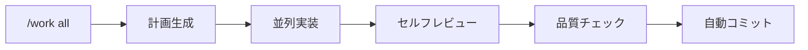

<p align="center">
  
</p>

<p align="center">
  <strong>Plan. Work. Review. Ship.</strong><br>
  <em>Claude Code を規律ある開発パートナーに変える</em>
</p>

<p align="center">
  <a href="VERSION"></a>
  <a href="LICENSE.md"></a>
  <a href="docs/CLAUDE_CODE_COMPATIBILITY.md"></a>
  
</p>

<p align="center">
  <a href="README.md">English</a> | 日本語
</p>

---

## なぜ Harness？

Claude Code は強力だが、時に構造が必要になる。

| Harness なし | Harness あり |
|--------------|--------------|
| すぐにコードを書き始める | まず計画、それから実行 |
| 頼まれたときだけレビュー | 全ての変更を自動レビュー |
| 過去の決定を忘れる | SSOT ファイルでコンテキストを保持 |
| `rm -rf` が警告なく実行される | 危険なコマンドをブロック |
| 一度に1タスク | 並列ワーカー |

**3つのコマンド。1つのワークフロー。本番品質のコード。**


---

## 動作要件

- **Claude Code v2.1+** ([インストールガイド](https://docs.anthropic.com/claude-code))
- **Node.js 18+** (セーフティフック用)

---

## 30秒でインストール

```bash
# プロジェクトで Claude Code を起動
claude

# マーケットプレイスを追加してインストール
/plugin marketplace add Chachamaru127/claude-code-harness
/plugin install claude-code-harness@claude-code-harness-marketplace

# プロジェクトを初期化
/harness-init
```

これだけ。`/plan-with-agent` から始めよう。

---

## Codex CLI セットアップ

Codex CLI を Team Config（共有 `.codex/`）で使う場合:

1. `codex/.codex` をプロジェクトの `.codex` にコピー
2. `codex/AGENTS.md` をプロジェクト直下の `AGENTS.md` としてコピー
3. 任意: `codex/.codex/config.toml` をコピーし、MCP サーバーのパスを設定

スクリプトでセットアップ:

```bash
/path/to/claude-code-harness/scripts/setup-codex.sh
```

Claude Code からは `/setup codex` でセッション内完結できます。

`$plan-with-agent`、`$work`、`$harness-review` を使ってフローを実行します。

---

## 🪄 説明が長い？ならこれ: /work all

**読むのが面倒？** これだけ打てばいい:

```
/work all
```

**このひと言で、Harness が全部やる。** 計画 → 並列実装 → レビュー → コミット。



| Before | After |
|--------|-------|
| `/plan-with-agent` → `/work` → `/harness-review` → `git commit` | `/work all` |
| 4回のコマンド | **1回** |

> ⚠️ **実験的機能**: 計画を承認したら、Claude が責任を持って完遂。品質チェックで問題があればコミットをブロック。

---

## コアループ（詳細）

### 1. Plan（計画）

```bash
/plan-with-agent
```

> 「メールバリデーション付きのログインフォームが欲しい」

Harness が明確な受入条件付きの `Plans.md` を作成。

### 2. Work（実装）

```bash
/work              # 並列数を自動検出
/work --parallel 5 # 5ワーカーで同時実行
```

各ワーカーが実装、セルフレビュー、報告を行う。

### 3. Review（レビュー）

```bash
/harness-review
```

| 視点 | 焦点 |
|------|------|
| Security | 脆弱性、インジェクション、認証 |
| Performance | ボトルネック、メモリ、スケーリング |
| Quality | パターン、命名、保守性 |
| Accessibility | WCAG準拠、スクリーンリーダー |

---

## セーフティファースト

Harness はフックでコードベースを保護:

| 保護対象 | アクション |
|----------|------------|
| `.git/`, `.env`, シークレット | 書き込みブロック |
| `rm -rf`, `sudo`, `--force` | 確認が必要 |
| `git status`, `npm test` | 自動許可 |
| テスト改ざん | 警告をトリガー |

---

## 45スキル、設定不要

スキルはコンテキストに応じて自動ロード。スラッシュコマンドでも自然言語でも起動可能。

| こう言うと | スキル |
|------------|--------|
| 「ログインを実装して」 | `impl` |
| 「このコードをレビューして」 | `harness-review` |
| 「ビルドエラーを直して」 | `verify` |
| 「Stripe決済を追加して」 | `auth` |
| 「Vercelにデプロイして」 | `deploy` |

### 主要コマンド

| コマンド | 機能 |
|----------|------|
| `/plan-with-agent` | アイデア → `Plans.md` |
| `/work` | タスクを並列実行 |
| `/harness-review` | 4視点レビュー |
| `/harness-init` | プロジェクト初期化 |
| `/sync-status` | 進捗確認 |
| `/memory` | SSOT ファイルを管理 |

---

## 誰のためのツール？

| あなたが | Harness でできること |
|----------|---------------------|
| **開発者** | 組み込み QA で高速に出荷 |
| **フリーランサー** | クライアントにレビューレポートを納品 |
| **インディーハッカー** | 壊さずに素早く動く |
| **VibeCoder** | 自然言語でアプリを構築 |
| **チームリード** | プロジェクト横断で標準を強制 |

---

## アーキテクチャ

```
claude-code-harness/
├── skills/       # 45のスキル定義
├── agents/       # 8つのサブエージェント（並列ワーカー）
├── hooks/        # セーフティ & オートメーション
├── scripts/      # ガードスクリプト
└── templates/    # 生成テンプレート
```

---

## 高度な機能

<details>
<summary><strong>Codex エンジン</strong></summary>

実装タスクを OpenAI Codex に並列委託:

```bash
/work --codex API エンドポイントを5つ実装して
```

Codex が実装 → セルフレビュー → 報告。Claude Code ワーカーと併用可能。

> **セットアップが必要**: [Codex CLI](https://github.com/openai/codex) をインストールし、APIキーを設定。

</details>

<details>
<summary><strong>2-Agent モード（Cursor連携）</strong></summary>

Cursor を PM として、Claude Code を実装者として使用。

```bash
/handoff       # Cursor PM に報告
```

Plans.md が両者間で同期。

</details>

<details>
<summary><strong>Codex レビュー連携</strong></summary>

OpenAI Codex でセカンドオピニオンを追加：

```bash
/harness-review  # 4視点 + Codex
```

Codex が16種のスペシャリストから4人の関連エキスパートを選出。

</details>

<details>
<summary><strong>動画生成</strong></summary>

JSON Schema 駆動のパイプラインでプロダクト動画を生成：

```bash
/generate-video
```

- JSON Schema を SSOT (Single Source of Truth) として使用
- 3層バリデーション: scene → scenario → E2E
- Remotion ベースの決定論的レンダリング

> **依存関係**: [Remotion](https://www.remotion.dev/) プロジェクトのセットアップと ffmpeg が必要。

</details>

<details>
<summary><strong>Agent Trace</strong></summary>

AI による編集操作を自動追跡：

```
.claude/state/agent-trace.jsonl
```

- Edit/Write 操作をタイムスタンプ付きで記録
- セッション終了時にプロジェクト名、現在のタスク、直近の編集を表示
- `/sync-status` で Plans.md と実際の変更を照合可能に

設定不要—デフォルトで有効。

</details>

---

## トラブルシューティング

| 問題 | 解決策 |
|------|--------|
| コマンドが見つからない | まず `/harness-init` を実行 |
| プラグインが読み込まれない | キャッシュをクリア: `rm -rf ~/.claude/plugins/cache/claude-code-harness-marketplace/` して再起動 |
| フックが動作しない | Node.js 18+ がインストールされているか確認 |

詳しいヘルプは [Issue を作成](https://github.com/Chachamaru127/claude-code-harness/issues)してください。

---

## アンインストール

```bash
/plugin uninstall claude-code-harness
```

プロジェクトファイル（Plans.md、SSOT ファイル）はそのまま残ります。

---

## ドキュメント

| リソース | 説明 |
|----------|------|
| [Changelog](CHANGELOG.md) | バージョン履歴 |
| [Claude Code 互換性](docs/CLAUDE_CODE_COMPATIBILITY.md) | 動作要件 |
| [Cursor 連携](docs/CURSOR_INTEGRATION.md) | 2-Agent セットアップ |

---

## コントリビュート

Issue と PR を歓迎します。[CONTRIBUTING.md](CONTRIBUTING.md) を参照。

---

## 謝辞

- [AI Masao](https://note.com/masa_wunder) — 階層的スキル設計
- [Beagle](https://github.com/beagleworks) — テスト改ざん防止パターン

---

## ライセンス

**MIT License** — 自由に使用、改変、商用利用可能。

[English](LICENSE.md) | [日本語](LICENSE.ja.md)
