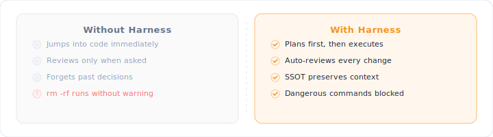
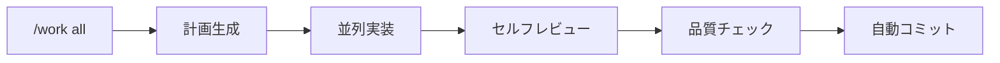

<p align="center">
  
</p>

<p align="center">
  <strong>Plan. Work. Review. Ship.</strong><br>
  <em>Claude Code を規律ある開発パートナーに変える</em>
</p>

<p align="center">
  <a href="VERSION"></a>
  <a href="LICENSE.md"></a>
  <a href="docs/CLAUDE_CODE_COMPATIBILITY.md"></a>
  
  
</p>

<p align="center">
  <a href="README.md">English</a> | 日本語
</p>

---

## なぜ Harness？

Claude Code は強力だが、時に構造が必要になる。

<p align="center">
  
</p>

<table>
<tr>
<td width="50%">

### ハーネスなし

- すぐにコードを書き始める
- 頼まれたときだけレビュー
- 過去の決定を忘れる
- `rm -rf` が警告なく実行される
- 一度に1タスク

</td>
<td width="50%">

### ハーネスあり

- **まず計画**、それから実行
- 全ての変更を**自動レビュー**
- **SSOT ファイル**でコンテキストを保持
- 危険なコマンドを**ブロック**
- **並列ワーカー**で同時実行

</td>
</tr>
</table>

**3つのコマンド。1つのワークフロー。本番品質のコード。**


---

## 動作要件

- **Claude Code v2.1+** ([インストールガイド](https://docs.anthropic.com/claude-code))
- **Node.js 18+** (TypeScript コアエンジン & セーフティフック用)

---

## 30秒でインストール

```bash
# プロジェクトで Claude Code を起動
claude

# マーケットプレイスを追加してインストール
/plugin marketplace add Chachamaru127/claude-code-harness
/plugin install claude-code-harness@claude-code-harness-marketplace

# プロジェクトを初期化
/harness-init
```

これだけ。`/plan-with-agent` から始めよう。

---

## 🪄 説明が長い？ならこれ: /work all

**読むのが面倒？** これだけ打てばいい:

```
/work all
```

**このひと言で、Harness が全部やる。** 計画 → 並列実装 → レビュー → コミット。



<p align="center">
  
</p>

| Before | After |
|--------|-------|
| `/plan-with-agent` → `/work` → `/harness-review` → `git commit` | `/work all` |
| 4回のコマンド | **1回** |

> ⚠️ **実験的機能**: 計画を承認したら、Claude が責任を持って完遂。品質チェックで問題があればコミットをブロック。

---

## コアループ（詳細）

<p align="center">
  
</p>

### 1. Plan（計画）

```bash
/plan-with-agent
```

> 「メールバリデーション付きのログインフォームが欲しい」

Harness が明確な受入条件付きの `Plans.md` を作成。

### 2. Work（実装）

```bash
/work              # 並列数を自動検出
/work --parallel 5 # 5ワーカーで同時実行
```

各ワーカーが実装、セルフレビュー、報告を行う。

<p align="center">
  
</p>

### 3. Review（レビュー）

```bash
/harness-review
```

| 視点 | 焦点 |
|------|------|
| Security | 脆弱性、インジェクション、認証 |
| Performance | ボトルネック、メモリ、スケーリング |
| Quality | パターン、命名、保守性 |
| Accessibility | WCAG準拠、スクリーンリーダー |

---

## セーフティファースト

<p align="center">
  
</p>

Harness v3 は **TypeScript ガードレールエンジン**（`core/`）でコードベースを保護 — 9つの宣言的ルール（R01–R09）、コンパイル済み＆型チェック済み:

| ルール | 保護対象 | アクション |
|--------|----------|------------|
| R01 | `sudo` コマンド | **拒否** |
| R02 | `.git/`, `.env`, シークレット | 書き込み**拒否** |
| R03 | `rm -rf /`, 破壊的パス | **拒否** |
| R04 | `git push --force` | **拒否** |
| R05–R09 | モード固有のガード | コンテキスト判定 |
| Post | `it.skip`, アサーション改ざん | **警告** |
| Perm | `git status`, `npm test` | **自動許可** |

<p align="center">
  
</p>

---

## 5動詞スキル、設定不要

v3 で42スキルを **5つの動詞スキル**に統合。コンテキストで自動ロード。スラッシュでも自然言語でもOK。

<table>
<tr>
<td align="center" width="20%"><h3>/plan</h3>アイデア → Plans.md</td>
<td align="center" width="20%"><h3>/work</h3>並列実装</td>
<td align="center" width="20%"><h3>/review</h3>4視点コードレビュー</td>
<td align="center" width="20%"><h3>/release</h3>タグ + GitHub Release</td>
<td align="center" width="20%"><h3>/setup</h3>プロジェクト初期化</td>
</tr>
</table>

<p align="center">
  
</p>

### 主要コマンド

| コマンド | 機能 | 旧コマンド |
|----------|------|-----------|
| `/harness-plan` | アイデア → `Plans.md` | `/plan-with-agent`, `/planning` |
| `/harness-work` | 並列実装 | `/work`, `/breezing`, `/impl` |
| `/harness-work all` | 計画 → 実装 → レビュー → コミット | `/work all` |
| `/harness-review` | 4視点コードレビュー | `/harness-review`, `/verify` |
| `/harness-release` | CHANGELOG、タグ、GitHub Release | `/release-har`, `/handoff` |
| `/harness-setup` | プロジェクト初期化 | `/harness-init`, `/setup` |
| `/memory` | SSOT ファイルを管理 | — |

---

## 誰のためのツール？

| あなたが | Harness でできること |
|----------|---------------------|
| **開発者** | 組み込み QA で高速に出荷 |
| **フリーランサー** | クライアントにレビューレポートを納品 |
| **インディーハッカー** | 壊さずに素早く動く |
| **VibeCoder** | 自然言語でアプリを構築 |
| **チームリード** | プロジェクト横断で標準を強制 |

---

## アーキテクチャ

```
claude-code-harness/
├── core/           # TypeScript ガードレールエンジン（strict ESM, NodeNext）
│   └── src/        #   guardrails/ state/ engine/
├── skills-v3/      # 5動詞スキル（plan/execute/review/release/setup）
├── agents-v3/      # 3エージェント（worker/reviewer/scaffolder）
├── hooks/          # 薄いシム → core/ エンジン
├── skills/         # 旧41スキル（互換性のため保持）
├── agents/         # 旧11エージェント（互換性のため保持）
├── scripts/        # v2 フックスクリプト（v3 core と共存）
└── templates/      # 生成テンプレート
```

---

## 高度な機能

<details>
<summary><strong>Breezing（Agent Teams）</strong></summary>

自律エージェントチームでタスクリストを一気に完走:

```bash
/breezing all                    # 計画レビュー + 並列実装
/breezing --no-discuss all       # 計画レビューをスキップして即実装
/breezing --codex all            # Codex エンジンに委託
```

<p align="center">
  
</p>

**Phase 0（計画議論）** がデフォルトで実行されます。Planner がタスクの品質を分析し、Critic が計画を批判的にチェック。あなたが承認してからコーディングが始まります。

| 機能 | 説明 |
|------|------|
| 計画議論 | Planner + Critic が計画をレビュー（デフォルトON） |
| タスク検証 (V1–V5) | スコープ・曖昧さ・重複・依存・TDD をチェック |
| Progressive Batching | 8タスク以上は自動でバッチ分割 |
| Hook シグナル | 部分レビューや次バッチの自動トリガー |

> **コスト**: デフォルトで約5.5倍のトークン（`--no-discuss` なら約4倍）。計画レビューにより手戻りが減るので投資対効果は高い。

</details>

<details>
<summary><strong>Codex エンジン</strong></summary>

実装タスクを OpenAI Codex に並列委託:

```bash
/work --codex API エンドポイントを5つ実装して
```

Codex が実装 → セルフレビュー → 報告。Claude Code ワーカーと併用可能。

> **セットアップが必要**: [Codex CLI](https://github.com/openai/codex) をインストールし、APIキーを設定。

</details>

<details>
<summary><strong>Codex CLI セットアップ</strong></summary>

[Codex CLI](https://github.com/openai/codex) で Harness を利用できます。Claude Code は不要です。

**前提条件**: [Codex CLI](https://github.com/openai/codex)（`npm i -g @openai/codex`）、OpenAI API キー（`OPENAI_API_KEY`）、Git。

```bash
# 1. Harness リポジトリをクローン
git clone https://github.com/Chachamaru127/claude-code-harness.git
cd claude-code-harness

# 2. スキル/ルールをユーザースコープ（~/.codex）にインストール
./scripts/setup-codex.sh --user

# 3. プロジェクトに移動して作業開始
cd /path/to/your-project
codex
```

Codex 内で `$plan-with-agent`、`$work`、`$breezing`、`$harness-review` を使ってワークフローを実行します。

| フラグ | 説明 |
|--------|------|
| `--user` | `~/.codex` にインストール（プロジェクト横断で共有、デフォルト） |
| `--project` | カレントディレクトリの `.codex/` にインストール |

> Claude Code ユーザーはセッション内で `/setup codex` を実行するだけで同じセットアップが適用されます。

</details>

<details>
<summary><strong>2-Agent モード（Cursor連携）</strong></summary>

Cursor を PM として、Claude Code を実装者として使用。

```bash
/handoff       # Cursor PM に報告
```

Plans.md が両者間で同期。

</details>

<details>
<summary><strong>Codex レビュー連携</strong></summary>

OpenAI Codex でセカンドオピニオンを追加：

```bash
/harness-review  # 4視点 + Codex CLI
```

Codex が `codex exec` 経由で、16種のスペシャリストから4人の関連エキスパートを選出。

</details>

<details>
<summary><strong>スライド生成</strong></summary>

1枚のプロジェクト紹介スライドを自動生成：

```bash
/generate-slide
```

- 3つのビジュアルパターン（Minimalist / Infographic / Hero）
- 各パターン2候補を品質スコアリング
- 最良3枚を `out/slides/selected/` に出力

> **前提**: `GOOGLE_AI_API_KEY` と Google AI Studio の利用設定。

</details>

<details>
<summary><strong>動画生成</strong></summary>

JSON Schema 駆動のパイプラインでプロダクト動画を生成：

```bash
/generate-video
```

- JSON Schema を SSOT (Single Source of Truth) として使用
- 3層バリデーション: scene → scenario → E2E
- Remotion ベースの決定論的レンダリング

> **依存関係**: [Remotion](https://www.remotion.dev/) プロジェクトのセットアップと ffmpeg が必要。

</details>

<details>
<summary><strong>Agent Trace</strong></summary>

AI による編集操作を自動追跡：

```
.claude/state/agent-trace.jsonl
```

- Edit/Write 操作をタイムスタンプ付きで記録
- セッション終了時にプロジェクト名、現在のタスク、直近の編集を表示
- `/sync-status` で Plans.md と実際の変更を照合可能に

設定不要—デフォルトで有効。

</details>

---

## トラブルシューティング

| 問題 | 解決策 |
|------|--------|
| コマンドが見つからない | まず `/harness-init` を実行 |
| プラグインが読み込まれない | キャッシュをクリア: `rm -rf ~/.claude/plugins/cache/claude-code-harness-marketplace/` して再起動 |
| フックが動作しない | Node.js 18+ がインストールされているか確認 |

詳しいヘルプは [Issue を作成](https://github.com/Chachamaru127/claude-code-harness/issues)してください。

---

## アンインストール

```bash
/plugin uninstall claude-code-harness
```

プロジェクトファイル（Plans.md、SSOT ファイル）はそのまま残ります。

---

## Claude Code 2.1.68+ 対応機能

Harness は最新の Claude Code 機能をすぐに活用できます。

| 機能 | スキル | 用途 |
|------|--------|------|
| **Agent Memory** | task-worker, code-reviewer | セッション間の永続的な学習 |
| **TeammateIdle/TaskCompleted Hook** | breezing | チームの自動監視 |
| **Worktree 分離** | breezing | 同一ファイルへの並列書き込みを安全化 |
| **HTTP hooks** | hooks | Slack・ダッシュボード・メトリクスへの JSON POST |
| **Effort levels + ultrathink** | harness-work | 複雑なタスクに ultrathink を自動注入 |
| **Agent hooks** | hooks | LLM によるコード品質ガード（secrets・TODO スタブ・セキュリティ） |
| **WorktreeCreate/Remove hook** | breezing | Worktree ライフサイクルの自動セットアップ・クリーンアップ |

全機能一覧（30件）: [docs/CLAUDE-feature-table.md](docs/CLAUDE-feature-table.md)

---

## ドキュメント

| リソース | 説明 |
|----------|------|
| [Changelog](CHANGELOG.md) | バージョン履歴 |
| [Claude Code 互換性](docs/CLAUDE_CODE_COMPATIBILITY.md) | 動作要件 |
| [Cursor 連携](docs/CURSOR_INTEGRATION.md) | 2-Agent セットアップ |

---

## コントリビュート

Issue と PR を歓迎します。[CONTRIBUTING.md](CONTRIBUTING.md) を参照。

---

## 謝辞

- [AI Masao](https://note.com/masa_wunder) — 階層的スキル設計
- [Beagle](https://github.com/beagleworks) — テスト改ざん防止パターン

---

## ライセンス

**MIT License** — 自由に使用、改変、商用利用可能。

[English](LICENSE.md) | [日本語](LICENSE.ja.md)
