# Claude Code Harness 完全マップ

このドキュメントは Claude Code Harness のすべての構成要素を体系的にまとめたリファレンスです。

---

## 目次

1. [全体アーキテクチャ](#1-全体アーキテクチャ)
2. [ワークフロー](#2-ワークフロー)
3. [コマンド一覧](#3-コマンド一覧)
4. [スキル一覧](#4-スキル一覧)
5. [エージェント一覧](#5-エージェント一覧)
6. [フック一覧](#6-フック一覧)
7. [ルール一覧](#7-ルール一覧)
8. [スクリプト一覧](#8-スクリプト一覧)
9. [テンプレート一覧](#9-テンプレート一覧)
10. [設定ファイル](#10-設定ファイル)
11. [ディレクトリ構造](#11-ディレクトリ構造)

---

## 1. 全体アーキテクチャ

### 1.1 システム構成図

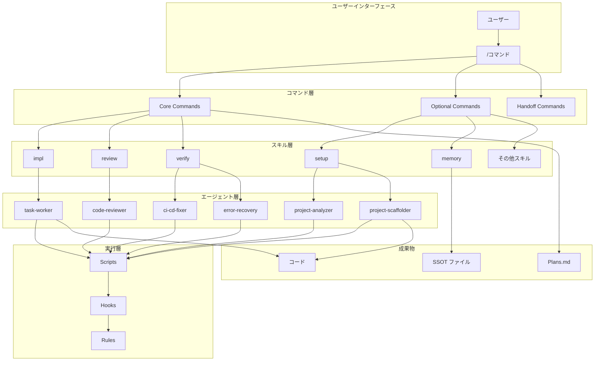

### 1.2 階層構造

```
┌─────────────────────────────────────────────────────────────┐
│  Commands（ユーザー向けインターフェース）                      │
│  ユーザーが /コマンド で呼び出す                              │
├─────────────────────────────────────────────────────────────┤
│  Skills（責務別ガイダンス）                                   │
│  コマンドが適切なスキルを自動選択・起動                        │
├─────────────────────────────────────────────────────────────┤
│  Agents（並列実行可能なサブエージェント）                      │
│  Task tool で並列起動、自律的にタスクを完了                    │
├─────────────────────────────────────────────────────────────┤
│  Scripts / Hooks / Rules（実装レベルの処理）                  │
│  ガード、検証、自動化を担当                                   │
└─────────────────────────────────────────────────────────────┘
```

### 1.3 品質保護の3層防御

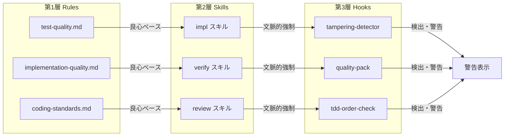

| 層    | 場所               | 強制力     | 動作タイミング |
| ----- | ------------------ | ---------- | -------------- |
| 第1層 | `.claude/rules/` | 良心ベース | 常時適用       |
| 第2層 | `skills/`        | 文脈的強制 | スキル使用時   |
| 第3層 | `hooks/`         | 検出・警告 | ツール実行後   |

---

## 2. ワークフロー

### 2.1 基本ワークフロー（Plan → Work → Review）

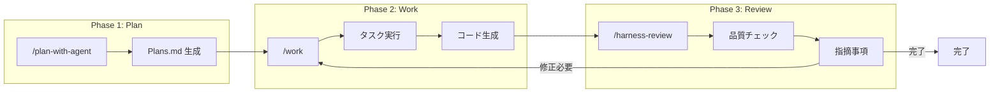

### 2.2 /work コマンドの詳細フロー

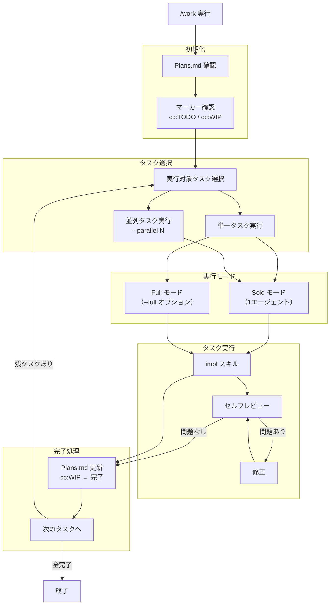

### 2.3 2-Agent ワークフロー（Claude Code × Cursor）

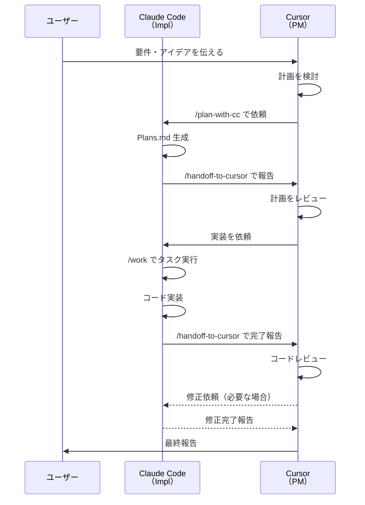

### 2.4 セッションライフサイクル

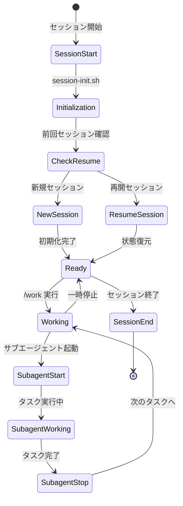

---

## 3. コマンド一覧

### 3.1 コマンド分類図

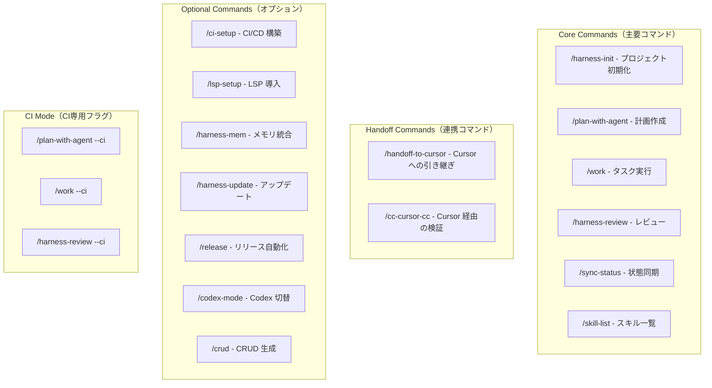

### 3.2 Core Commands 詳細

| コマンド             | 説明                                                                   | 主な出力                           |
| -------------------- | ---------------------------------------------------------------------- | ---------------------------------- |
| `/harness-init`    | プロジェクトの初期化。環境チェック→ファイル生成→SSOT同期→検証を実行 | CLAUDE.md, Plans.md, SSOT ファイル |
| `/plan-with-agent` | アイデアから実装計画を作成。Plans.md にタスクを生成                    | Plans.md（cc:TODO マーカー付き）   |
| `/work`            | Plans.md のタスクを実行。Solo/2-Agent、並列実行に対応                  | コード変更、Plans.md 更新          |
| `/harness-review`  | 多角的なコードレビュー。セキュリティ・パフォーマンス・品質をチェック   | 指摘事項リスト                     |
| `/sync-status`     | 進捗状況を確認し、Plans.md を更新。次のアクションを提案                | 状態レポート、Plans.md 更新        |
| `/skill-list`      | 利用可能なスキルと説明を一覧表示                                       | スキル一覧                         |

### 3.3 Handoff Commands 詳細

| コマンド               | 説明                                                             | 用途                      |
| ---------------------- | ---------------------------------------------------------------- | ------------------------- |
| `/handoff-to-cursor` | 完了レポートを生成し、Cursor（PM）に引き継ぐ                     | 2-Agent: Impl → PM       |
| `/cc-cursor-cc`      | Cursor でアイデアを検証し、Plans.md を更新後、Claude Code に戻す | 2-Agent: 計画の妥当性確認 |

### 3.4 Optional Commands 詳細

| コマンド                   | 説明                                                          | 用途                     |
| -------------------------- | ------------------------------------------------------------- | ------------------------ |
| `/ci-setup`              | GitHub Actions などの CI/CD パイプラインを構築                | CI/CD 自動化             |
| `/lsp-setup`             | Language Server Protocol を導入・設定                         | コード補完・定義ジャンプ |
| `/harness-mem`           | claude-mem との統合をセットアップ                             | 横断セッションメモリ     |
| `/harness-update`        | ハーネスを最新バージョンに安全にアップデート                  | バージョン管理           |
| `/harness-ui`            | harness-ui ダッシュボードを起動（未セットアップなら自動構築） | 可視化                   |
| `/release`               | CHANGELOG 更新、バージョン更新、タグ作成を自動化              | リリース管理             |
| `/codex-mode`            | Codex モードの ON/OFF を切り替え                              | セカンドオピニオン       |
| `/codex-review`          | Codex MCP を使ったセカンドオピニオンレビュー                  | 別 AI によるレビュー     |
| `/crud`                  | CRUD 機能を自動生成（バリデーション、認証、本番品質）         | 機能生成                 |
| `/skills-update`         | Skills Gate の対象スキルを管理（add/remove/enable/disable）   | スキル管理               |
| `/sync-project-specs`    | 作業後に Plans.md 等が更新されているか確認・同期              | 整合性確認               |
| `/sync-ssot-from-memory` | メモリシステムの重要な観察を SSOT に昇格                      | ナレッジ管理             |
| `/localize-rules`        | プロジェクト構造に合わせてルールをローカライズ                | カスタマイズ             |

### 3.5 CI Mode 詳細

| コマンド                | 説明                                    | 用途               |
| ----------------------- | --------------------------------------- | ------------------ |
| `/plan-with-agent --ci` | 非対話型の計画作成（CI/ベンチマーク用） | 自動化パイプライン |
| `/work --ci`            | 非対話型の実装実行（CI/ベンチマーク用） | 自動化パイプライン |
| `/harness-review --ci`  | 非対話型のレビュー（CI/ベンチマーク用） | 自動化パイプライン |

---

## 4. スキル一覧

### 4.1 スキル分類図

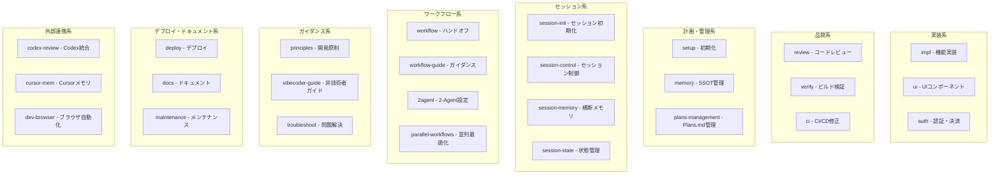

### 4.2 スキル詳細一覧

#### 実装系スキル

| スキル   | 説明                                              | トリガー例                                 |
| -------- | ------------------------------------------------- | ------------------------------------------ |
| `impl` | Plans.md のタスクに基づいてコードを実装           | 「実装して」「機能追加」「コードを書いて」 |
| `ui`   | UIコンポーネントやフォームを生成                  | 「コンポーネント」「ヒーロー」「フォーム」 |
| `auth` | Clerk/Supabase Auth/Stripe を使った認証・決済機能 | 「ログイン」「Clerk」「Stripe」「決済」    |

#### 品質系スキル

| スキル     | 説明                                               | トリガー例                                     |
| ---------- | -------------------------------------------------- | ---------------------------------------------- |
| `review` | セキュリティ・パフォーマンス・品質の多角的レビュー | 「レビュー」「セキュリティ」「パフォーマンス」 |
| `verify` | ビルド検証、エラー復旧、レビュー修正の適用         | 「ビルド」「エラー復旧」「検証して」           |
| `ci`     | CI/CD パイプラインの問題を診断・修正               | 「CI が落ちた」「テスト失敗」                  |

#### 計画・管理系スキル

| スキル               | 説明                                              | トリガー例                                      |
| -------------------- | ------------------------------------------------- | ----------------------------------------------- |
| `setup`            | 新規プロジェクトの初期化、CLAUDE.md/Plans.md 生成 | 「セットアップ」「初期化」「新規プロジェクト」  |
| `memory`           | SSOT ファイル（decisions.md, patterns.md）の管理  | 「SSOT」「decisions.md」「マージ」              |
| `plans-management` | Plans.md のタスク・マーカー操作                   | 「タスク追加」「Plans.md 更新」「マーカー変更」 |

#### セッション系スキル

| スキル              | 説明                                               | トリガー例                               |
| ------------------- | -------------------------------------------------- | ---------------------------------------- |
| `session-init`    | 環境チェックとタスク状態の概要表示でセッション開始 | 「セッション開始」「状態確認」           |
| `session-control` | /work のセッション再開・フォーク制御               | （内部使用）                             |
| `session-memory`  | 横断セッション学習とメモリ永続化                   | 「前回のセッション」「履歴」「続きから」 |
| `session-state`   | SESSION_ORCHESTRATION.md に基づく状態遷移          | （内部使用）                             |

#### ワークフロー系スキル

| スキル                 | 説明                                             | トリガー例                             |
| ---------------------- | ------------------------------------------------ | -------------------------------------- |
| `workflow`           | ハンドオフ管理、レビューコメントの自動修正       | 「ハンドオフ」「PMに報告」「自動修正」 |
| `workflow-guide`     | Cursor ↔ Claude Code 2-Agent ワークフローの解説 | 「ワークフロー」「コラボ」「プロセス」 |
| `2agent`             | 2-Agent ワークフローの設定                       | 「2-Agent」「Cursor設定」「PM連携」    |
| `parallel-workflows` | 複数タスクの並列実行最適化                       | 「並列で」「同時に」                   |

#### ガイダンス系スキル

| スキル              | 説明                                         | トリガー例                             |
| ------------------- | -------------------------------------------- | -------------------------------------- |
| `principles`      | 開発原則、ガイドライン、VibeCoder 向け指針   | 「原則」「ガイドライン」「安全性」     |
| `vibecoder-guide` | 非技術者が自然言語で開発を進めるためのガイド | 「次は何をすれば」「使い方」「困った」 |
| `troubleshoot`    | 問題発生時の診断・解決ガイド                 | 「壊れた」「エラー」「動かない」       |

#### デプロイ・ドキュメント系スキル

| スキル          | 説明                                                        | トリガー例                                 |
| --------------- | ----------------------------------------------------------- | ------------------------------------------ |
| `deploy`      | Vercel/Netlify へのデプロイ、アナリティクス、ヘルスチェック | 「デプロイ」「Vercel」「GA」               |
| `docs`        | NotebookLM YAML やスライド用ドキュメント生成                | 「ドキュメント」「NotebookLM」「スライド」 |
| `maintenance` | プロジェクトファイルの整理・クリーンアップ                  | 「整理して」「クリーンアップ」             |

#### 外部連携系スキル

| スキル           | 説明                                                           | トリガー例                                           |
| ---------------- | -------------------------------------------------------------- | ---------------------------------------------------- |
| `codex-review` | OpenAI Codex CLI を MCP サーバーとして統合、セカンドオピニオン | 「Codex レビュー」「セカンドオピニオン」             |
| `cursor-mem`   | Cursor から claude-mem MCP サーバーにアクセス                  | 「メモリ検索」「過去の決定」                         |
| `dev-browser`  | 永続的なページ状態でのブラウザ自動化                           | 「URL にアクセス」「クリック」「スクリーンショット」 |

---

## 5. エージェント一覧

### 5.1 エージェント構成図

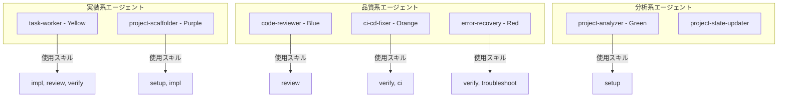

### 5.2 エージェント詳細

| エージェント              | 説明                                                   | 使用スキル           | 主なツール                          | 色        |
| ------------------------- | ------------------------------------------------------ | -------------------- | ----------------------------------- | --------- |
| `task-worker`           | 単一タスクの実装→セルフレビュー→検証を自己完結で実行 | impl, review, verify | Read, Write, Edit, Bash, Grep, Glob | 🟡 Yellow |
| `code-reviewer`         | セキュリティ/パフォーマンス/品質を多角的にレビュー     | review               | Read, Grep, Glob, Bash              | 🔵 Blue   |
| `project-analyzer`      | 新規/既存プロジェクトの判定と技術スタック検出          | setup                | Read, Bash, Glob, Grep              | 🟢 Green  |
| `project-scaffolder`    | 指定スタックで動くプロジェクトを自動生成               | setup, impl          | Write, Bash, Read, Glob             | 🟣 Purple |
| `ci-cd-fixer`           | CI 失敗時の診断・修正を安全第一で支援                  | verify, ci           | Read, Write, Bash, Grep, Glob       | 🟠 Orange |
| `error-recovery`        | エラー復旧（原因切り分け→安全な修正→再検証）         | verify, troubleshoot | Read, Write, Edit, Bash, Grep, Glob | 🔴 Red    |
| `project-state-updater` | Plans.md とセッション状態の同期・ハンドオフ支援        | -                    | Read, Write, Edit, Bash, Grep       | -         |

### 5.3 エージェントの呼び出し方

エージェントは `Task` ツールで並列起動できます。

```
Task tool:
  subagent_type: "task-worker"
  prompt: "認証機能を実装してください"
```

---

## 6. フック一覧

### 6.1 ライフサイクルフック図

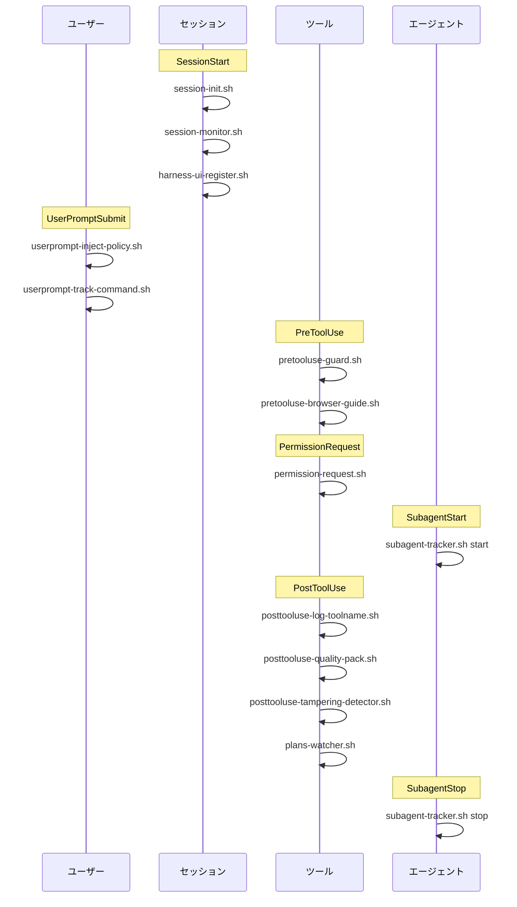

### 6.2 フック詳細一覧

#### SessionStart（セッション開始時）

| スクリプト                 | 説明                                    | ブロッキング |
| -------------------------- | --------------------------------------- | ------------ |
| `session-init.sh`        | プロジェクト状態の初期化、Plans.md 確認 | No           |
| `session-monitor.sh`     | セッション監視の開始                    | No           |
| `harness-ui-register.sh` | harness-ui へのセッション登録           | No           |
| `session-resume.sh`      | 前回セッションの状態復元（resume 時）   | No           |

#### UserPromptSubmit（ユーザー入力提出時）

| スクリプト                      | 説明                      | ブロッキング |
| ------------------------------- | ------------------------- | ------------ |
| `userprompt-inject-policy.sh` | LSP/Skills ポリシーの注入 | No           |
| `userprompt-track-command.sh` | コマンド使用の追跡        | No           |

#### PreToolUse（ツール実行前）

| スクリプト                      | 説明                       | ブロッキング    |
| ------------------------------- | -------------------------- | --------------- |
| `pretooluse-guard.sh`         | 危険な操作の警告・ブロック | Yes（条件付き） |
| `pretooluse-browser-guide.sh` | ブラウザ操作時のガイダンス | No              |

#### PermissionRequest（パーミッション要求時）

| スクリプト                | 説明                     | ブロッキング |
| ------------------------- | ------------------------ | ------------ |
| `permission-request.sh` | パーミッション要求の処理 | No           |

#### SubagentStart / SubagentStop（サブエージェント開始/終了）

| スクリプト                    | 説明                       | ブロッキング |
| ----------------------------- | -------------------------- | ------------ |
| `subagent-tracker.sh start` | サブエージェント開始の追跡 | No           |
| `subagent-tracker.sh stop`  | サブエージェント終了の追跡 | No           |

#### PostToolUse（ツール実行後）

| スクリプト                            | 説明                       | ブロッキング |
| ------------------------------------- | -------------------------- | ------------ |
| `posttooluse-log-toolname.sh`       | ツール使用のログ記録       | No           |
| `posttooluse-commit-cleanup.sh`     | コミット後のクリーンアップ | No           |
| `usage-tracker.sh`                  | 使用状況の追跡             | No           |
| `posttooluse-clear-pending.sh`      | 保留状態のクリア           | No           |
| `auto-cleanup-hook.sh`              | 自動ファイルクリーンアップ | No           |
| `track-changes.sh`                  | 変更の追跡                 | No           |
| `auto-test-runner.sh`               | テストの自動実行           | No           |
| `posttooluse-quality-pack.sh`       | 品質パックのチェック       | No           |
| `plans-watcher.sh`                  | Plans.md の監視            | No           |
| `tdd-order-check.sh`                | TDD 順序の確認             | No           |
| `posttooluse-tampering-detector.sh` | テスト改ざんの検出         | No           |

### 6.3 フック設定ファイル

```
hooks/hooks.json          ← 開発用ソース
.claude-plugin/hooks.json ← プラグイン配布用（同期必須）
```

同期コマンド: `./scripts/sync-plugin-cache.sh`

---

## 7. ルール一覧

### 7.1 ルールファイル構成

```
.claude/rules/
├── CLAUDE.md              # ルール全体ガイド
├── command-editing.md     # コマンドファイル編集ルール
├── github-release.md      # GitHubリリースノート作成ルール
├── harness-ui.md          # harness-UI関連ルール
├── hooks-editing.md       # hooks.json編集ルール
└── shell-scripts.md       # シェルスクリプト作成ルール
```

### 7.2 ルール詳細

| ルール                 | 適用対象             | 主な内容                                                   |
| ---------------------- | -------------------- | ---------------------------------------------------------- |
| `command-editing.md` | `commands/**/*.md` | YAML frontmatter 形式、命名規則、完全修飾名の生成ルール    |
| `github-release.md`  | GitHub Releases      | 必須フォーマット（What's Changed, Before→After テーブル） |
| `harness-ui.md`      | harness-ui           | UI 関連の実装ルール                                        |
| `hooks-editing.md`   | `hooks/hooks.json` | 2 ファイル同期、タイプ定義、ブロッキング設定               |
| `shell-scripts.md`   | `scripts/**/*.sh`  | シェルスクリプトの記述ルール                               |

### 7.3 テンプレート提供ルール

`templates/rules/` で提供される品質ルール：

| ルール                        | 説明                     |
| ----------------------------- | ------------------------ |
| `coding-standards.md`       | コーディング規約         |
| `implementation-quality.md` | 実装品質（形骸化防止）   |
| `security-guidelines.md`    | セキュリティガイドライン |
| `test-quality.md`           | テスト品質（改ざん防止） |

---

## 8. スクリプト一覧

### 8.1 スクリプト分類

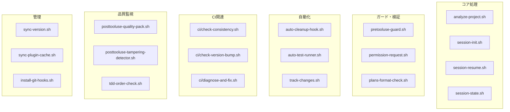

### 8.2 主要スクリプト詳細

#### コア処理

| スクリプト             | 説明                                   | 引数        |
| ---------------------- | -------------------------------------- | ----------- |
| `analyze-project.sh` | プロジェクトの技術スタック・構造を分析 | -           |
| `session-init.sh`    | セッション初期化、Plans.md 状態表示    | -           |
| `session-resume.sh`  | 前回セッションの状態復元               | -           |
| `session-state.sh`   | セッション状態の取得・更新             | get/set     |
| `session-control.sh` | セッション制御（再開/フォーク）        | resume/fork |
| `session-monitor.sh` | セッション監視                         | -           |
| `session-summary.sh` | セッションサマリー生成                 | -           |

#### ガード・検証

| スクリプト                | 説明                      | 引数             |
| ------------------------- | ------------------------- | ---------------- |
| `pretooluse-guard.sh`   | 危険な操作のガード        | tool_name, input |
| `permission-request.sh` | パーミッション要求処理    | permission_type  |
| `plans-format-check.sh` | Plans.md フォーマット検証 | file_path        |
| `plans-watcher.sh`      | Plans.md 変更監視         | -                |

#### 自動化

| スクリプト               | 説明                   | 引数 |
| ------------------------ | ---------------------- | ---- |
| `auto-cleanup-hook.sh` | 不要ファイルの自動削除 | -    |
| `auto-test-runner.sh`  | テストの自動実行       | -    |
| `track-changes.sh`     | ファイル変更の追跡     | -    |
| `template-tracker.sh`  | テンプレート使用の追跡 | -    |

#### CI 関連（`scripts/ci/`）

| スクリプト                     | 説明                         | 用途 |
| ------------------------------ | ---------------------------- | ---- |
| `check-consistency.sh`       | 設定ファイルの整合性チェック | CI   |
| `check-version-bump.sh`      | バージョン更新の確認         | CI   |
| `check-template-registry.sh` | テンプレートレジストリの確認 | CI   |
| `check-checklist-sync.sh`    | チェックリストの同期確認     | CI   |
| `diagnose-and-fix.sh`        | CI 問題の診断・修正          | CI   |

#### 品質監視

| スクリプト                            | 説明                 | 検出対象                           |
| ------------------------------------- | -------------------- | ---------------------------------- |
| `posttooluse-quality-pack.sh`       | 品質パックのチェック | 複数の品質指標                     |
| `posttooluse-tampering-detector.sh` | テスト改ざんの検出   | it.skip, test.skip, eslint-disable |
| `tdd-order-check.sh`                | TDD 順序の確認       | テスト先行の確認                   |

#### 管理

| スクリプト                 | 説明                                  | 引数            |
| -------------------------- | ------------------------------------- | --------------- |
| `sync-version.sh`        | VERSION ファイルと plugin.json の同期 | check/bump/sync |
| `sync-plugin-cache.sh`   | hooks.json の同期                     | -               |
| `install-git-hooks.sh`   | Git フックのインストール              | -               |
| `harness-ui-register.sh` | harness-ui へのセッション登録         | -               |
| `localize-rules.sh`      | ルールのローカライズ                  | -               |

#### ユーティリティ

| スクリプト                  | 説明                    | 用途       |
| --------------------------- | ----------------------- | ---------- |
| `frontmatter-utils.sh`    | YAML frontmatter の解析 | 共通関数   |
| `path-utils.sh`           | パス操作ユーティリティ  | 共通関数   |
| `skill-child-reminder.sh` | 子スキルのリマインダー  | スキル管理 |
| `usage-tracker.sh`        | 使用状況の追跡          | 分析       |

---

## 9. テンプレート一覧

### 9.1 テンプレート構成

```
templates/
├── claude/                    # Claude 設定
│   ├── settings.local.json
│   └── settings.security.json
├── cursor/                    # Cursor 用コマンド
│   ├── handoff-to-claude.md
│   ├── plan-with-cc.md
│   └── ...
├── hooks/                     # フック
│   └── auto-cleanup-hook.sh
├── mcp/                       # MCP 設定
│   └── harness-ui.mcp.json
├── memory/                    # メモリ（SSOT）
│   ├── decisions.md
│   ├── patterns.md
│   └── session-log.md
├── modes/                     # モード設定
│   ├── harness.json
│   └── harness--ja.json
├── rules/                     # ルール
│   ├── coding-standards.md
│   ├── implementation-quality.md
│   ├── security-guidelines.md
│   └── test-quality.md
├── state/                     # 状態管理
│   ├── skills-config.json
│   └── skills-policy.json
├── AGENTS.md.template         # AGENTS.md 初期テンプレート
├── CLAUDE.md                  # CLAUDE.md ガイド
├── CLAUDE.md.template         # CLAUDE.md 初期テンプレート
├── Plans.md.template          # Plans.md 初期テンプレート
└── template-registry.json     # テンプレートレジストリ
```

### 9.2 テンプレート詳細

#### プロジェクト初期化テンプレート

| テンプレート           | 生成先        | 説明                   |
| ---------------------- | ------------- | ---------------------- |
| `CLAUDE.md.template` | `CLAUDE.md` | プロジェクト固有の指示 |
| `AGENTS.md.template` | `AGENTS.md` | エージェント設定       |
| `Plans.md.template`  | `Plans.md`  | タスク管理             |

#### SSOT テンプレート（`templates/memory/`）

| テンプレート       | 生成先                            | 説明                  |
| ------------------ | --------------------------------- | --------------------- |
| `decisions.md`   | `.claude/memory/decisions.md`   | 決定事項（Why）       |
| `patterns.md`    | `.claude/memory/patterns.md`    | 再利用パターン（How） |
| `session-log.md` | `.claude/memory/session-log.md` | セッションログ        |

#### ルールテンプレート（`templates/rules/`）

| テンプレート                  | 生成先                                      | 説明                     |
| ----------------------------- | ------------------------------------------- | ------------------------ |
| `coding-standards.md`       | `.claude/rules/coding-standards.md`       | コーディング規約         |
| `implementation-quality.md` | `.claude/rules/implementation-quality.md` | 実装品質ルール           |
| `security-guidelines.md`    | `.claude/rules/security-guidelines.md`    | セキュリティガイドライン |
| `test-quality.md`           | `.claude/rules/test-quality.md`           | テスト品質ルール         |

#### Cursor 用テンプレート（`templates/cursor/`）

| テンプレート             | 説明                             |
| ------------------------ | -------------------------------- |
| `handoff-to-claude.md` | Claude Code への引き継ぎコマンド |
| `plan-with-cc.md`      | Claude Code での計画作成依頼     |

---

## 10. 設定ファイル

### 10.1 プラグイン設定

| ファイル                            | 説明                                             |
| ----------------------------------- | ------------------------------------------------ |
| `.claude-plugin/plugin.json`      | プラグインマニフェスト（名前、バージョン、説明） |
| `.claude-plugin/hooks.json`       | ライフサイクルフック定義（配布用）               |
| `.claude-plugin/marketplace.json` | マーケットプレイス登録情報                       |

### 10.2 バージョン管理

| ファイル                         | 説明                                 |
| -------------------------------- | ------------------------------------ |
| `VERSION`                      | バージョンのソース・オブ・トゥルース |
| `.claude-code-harness-version` | プロジェクト毎のハーネスバージョン   |

### 10.3 ハーネス設定

| ファイル                                   | 説明             |
| ------------------------------------------ | ---------------- |
| `.claude-code-harness.config.yaml`       | ハーネス全体設定 |
| `claude-code-harness.config.schema.json` | 設定スキーマ検証 |

### 10.4 プロジェクト状態（`templates/state/`）

| ファイル               | 説明           |
| ---------------------- | -------------- |
| `skills-config.json` | スキル設定     |
| `skills-policy.json` | スキルポリシー |

---

## 11. ディレクトリ構造

```
claude-code-harness/
├── .claude-plugin/           # プラグインマニフェスト
│   ├── plugin.json
│   ├── hooks.json
│   ├── marketplace.json
│   └── CLAUDE.md
├── commands/                 # スラッシュコマンド
│   ├── core/                 # 主要コマンド（11個）
│   ├── handoff/              # 連携コマンド（2個）
│   └── optional/             # オプションコマンド（17個）
├── skills/                   # スキル（28個）
│   ├── impl/
│   ├── review/
│   ├── verify/
│   ├── setup/
│   ├── memory/
│   ├── session-init/
│   ├── workflow/
│   └── ...
├── agents/                   # サブエージェント（8個）
│   ├── task-worker.md
│   ├── code-reviewer.md
│   ├── project-analyzer.md
│   └── ...
├── hooks/                    # ライフサイクルフック
│   └── hooks.json
├── scripts/                  # シェルスクリプト（50+）
│   ├── ci/                   # CI関連
│   ├── i18n/                 # 国際化
│   └── ...
├── templates/                # テンプレート
│   ├── claude/
│   ├── cursor/
│   ├── memory/
│   ├── rules/
│   └── ...
├── docs/                     # ドキュメント
├── tests/                    # テスト
├── CLAUDE.md                 # プロジェクトガイド
├── VERSION                   # バージョン
├── CHANGELOG.md              # 変更履歴
└── README.md                 # README
```

---

## 統計サマリー

| カテゴリ                 | 数量         |
| ------------------------ | ------------ |
| コマンド（Core）         | 11           |
| コマンド（Handoff）      | 2            |
| コマンド（Optional）     | 17           |
| **コマンド合計**   | **30** |
| スキル                   | 28           |
| エージェント             | 8            |
| スクリプト               | 50+          |
| ルール                   | 6            |
| テンプレートカテゴリ     | 8            |
| ライフサイクルフック種別 | 8            |

---

## クイックリファレンス

### よく使うコマンド

```bash
# 初期化
/harness-init

# 基本ワークフロー
/plan-with-agent    # 計画作成
/work               # 実装
/harness-review     # レビュー

# 状態確認
/sync-status
/skill-list

# 2-Agent 連携
/handoff-to-cursor
```

### マーカー凡例

| マーカー       | 状態        | 説明                   |
| -------------- | ----------- | ---------------------- |
| `cc:TODO`    | 未着手      | Claude Code が実行予定 |
| `cc:WIP`     | 作業中      | Claude Code が実装中   |
| `cc:blocked` | ブロック中  | 依存タスク待ち         |
| `pm:依頼中`  | PM から依頼 | 2-Agent 運用時         |

---

*このドキュメントは Claude Code Harness v2.9.22 に基づいています。*
