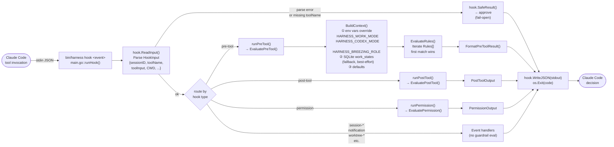
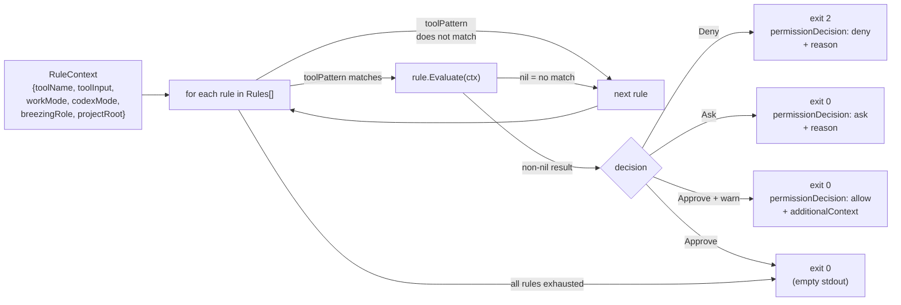
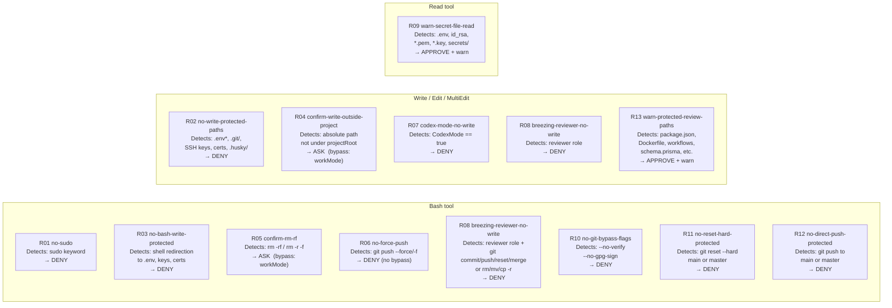
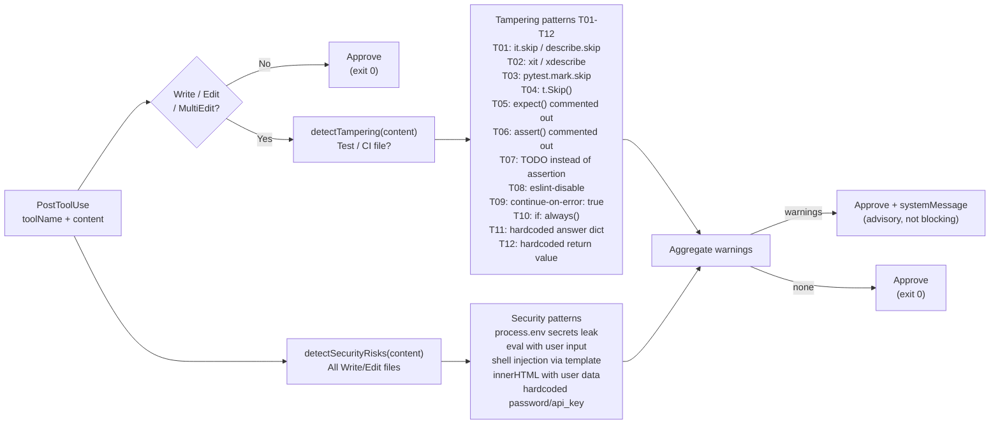
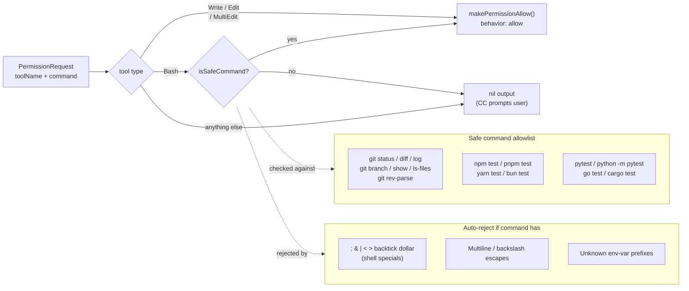
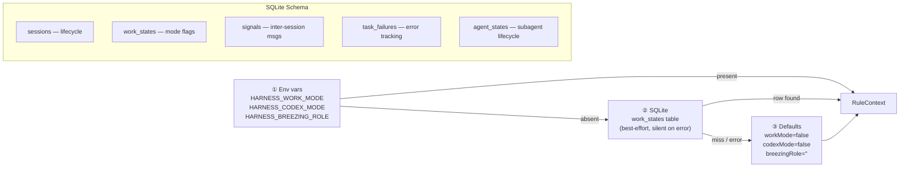
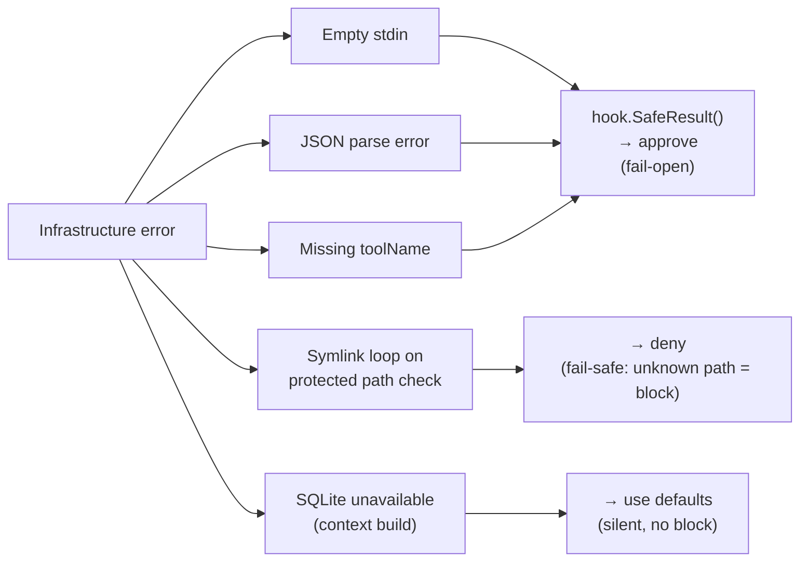

# Go Guardrail Engine

How the Go binary (`bin/harness`) evaluates every Claude Code tool invocation in real time.

---

## End-to-End Flow

---

## Rule Engine (Pre-Tool)

---

## Rules R01 – R13

---

## Post-Tool Pipeline (Tampering + Security Scan)

---

## Permission Handler

---

## State Resolution (Context Building)

---

## Fail-Safe Design

> **Principle**: Hook infrastructure failures never lock users out. Only explicit rule matches deny. Symlink errors are the one exception — an unresolvable path is treated as protected.

---

## Key Implementation Details

| Property | Value |
|----------|-------|
| **Latency target** | < 5 ms per hook invocation |
| **Rule evaluation** | Short-circuit — first match wins |
| **Regex compilation** | Pre-compiled at package `init()` |
| **Whitespace normalization** | Applied before all regex (bypass defence) |
| **Protected paths** | `.env*`, `.git/`, SSH keys, certs, `.husky/` |
| **Protected branches** | `main`, `master` (and `origin/`, `upstream/` prefixes) |
| **Binary size** | ~2.5 MB (darwin/arm64, stripped) |
| **External deps** | stdlib + `google/uuid` only |
| **DB access** | Best-effort SQLite; silently ignored on error |
| **Exit codes** | `0` = allow, `2` = deny |

> See `internal/guardrail/` for rule source and `internal/hook/codec.go` for the stdin/stdout codec.
