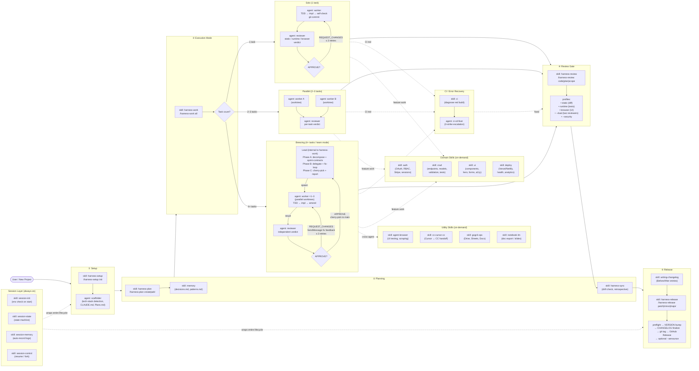
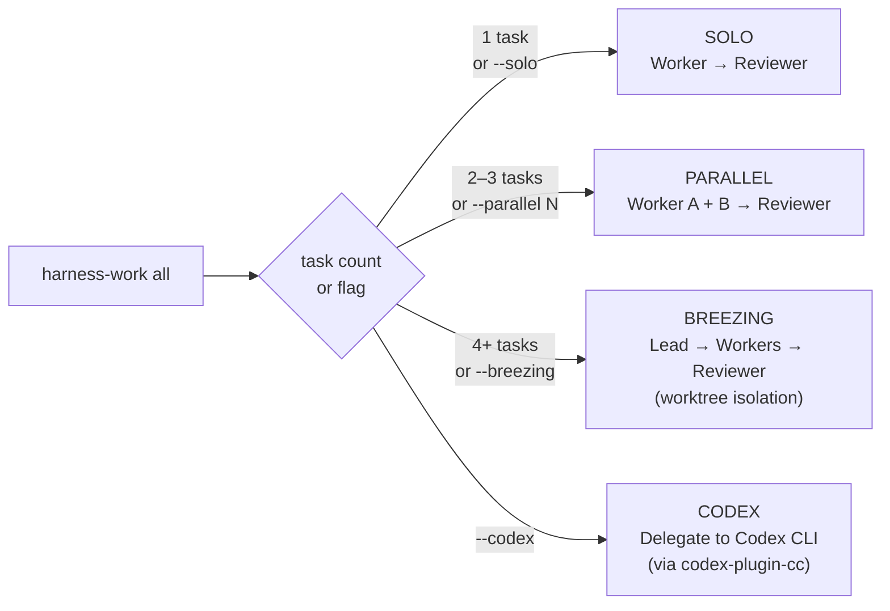
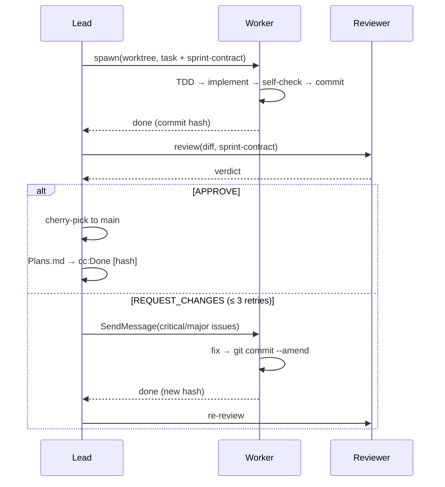
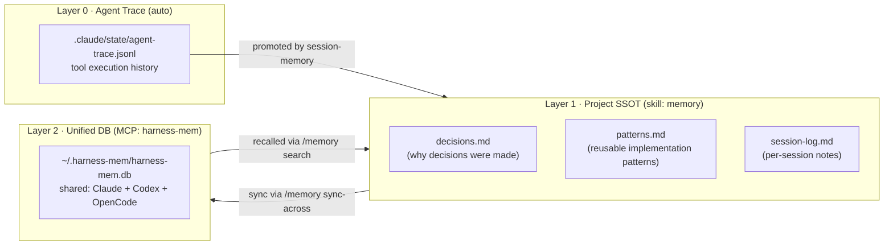

# Harness — Workflow Overview

Full lifecycle of a feature from project init to release, showing which skills and agents are active at each stage.

---

## Primary Workflow



---

## Execution Mode Decision



---

## Breezing Fix Loop (most common review cycle)



---

## Memory & Session Architecture



---

## Skill Catalog by Lifecycle Phase

| Phase | Skill | Trigger |
|-------|-------|---------|
| **Setup** | `harness-setup` | `/harness-setup init` |
| **Planning** | `harness-plan` | `/harness-plan create\|add\|update` |
| **Planning** | `harness-sync` | `/harness-sync` or "where am I?" |
| **Implementation** | `harness-work` | `/harness-work all\|N\|--breezing` |
| **Implementation** | `breezing` | `/breezing all` (alias for team mode) |
| **Implementation** | `auth` | building login / OAuth / payments |
| **Implementation** | `crud` | building data endpoints |
| **Implementation** | `ui` | building components / pages |
| **Implementation** | `deploy` | shipping to Vercel / Netlify |
| **CI Recovery** | `ci` | red build or "diagnose CI" |
| **Review** | `harness-review` | `/harness-review code\|plan\|scope` |
| **Release** | `writing-changelog` | before release, drafting entries |
| **Release** | `harness-release` | `/harness-release patch\|minor\|major` |
| **Memory** | `memory` | `/memory ssot\|sync\|search\|record` |
| **Session** | `session-init` | auto — every session start |
| **Session** | `session-control` | auto — resume / fork flags |
| **Session** | `session-memory` | auto — session end recording |
| **Utility** | `agent-browser` | UI testing, web scraping |
| **Utility** | `cc-cursor-cc` | Cursor ↔ Claude Code handoff |
| **Utility** | `gogcli-ops` | Google Workspace read/write |
| **Utility** | `notebook-lm` | doc export, slide generation |
| **Guidance** | `workflow-guide` | "how does this work?" |
| **Guidance** | `vibecoder-guide` | non-technical orientation |
| **Guidance** | `principles` | coding guidelines reference |

---

## Agent Roles

| Agent | Role | Permissions |
|-------|------|-------------|
| **scaffolder** | Project init, tech-stack detection, state updates | Read / Write / Edit |
| **worker** | TDD, implementation, self-check, git commit | Read / Write / Edit / Bash |
| **reviewer** | Independent verdict against sprint-contract | Read / Grep / Glob only |
| **ci-cd-fixer** | CI failure diagnosis and fix with 3-strike escalation | Read / Write / Edit / Bash |
| **Lead** *(internal)* | Orchestrate phases A→B→C in breezing mode | Spawns Worker + Reviewer |

> See `agents/` for full agent definitions and [hooks/README.md](hooks/README.md) for the hook event map.

---

## Hooks

Hooks are the always-on automation layer — they fire on Claude Code events (PreToolUse, PostToolUse, SessionStart, Stop, etc.) and invoke Go binary handlers or shell scripts without any user action required.

```
Claude Code Event → hooks.json matcher → Go binary (bin/harness) → handler script
```

Key hook groups at a glance:

| Event | What fires |
|-------|-----------|
| **PreToolUse** `Write\|Edit` | Guardrail check, inbox scan, secrets agent |
| **PostToolUse** `Write\|Edit\|Task` | Memory bridge, trace, auto-test, quality-pack, plans-watcher |
| **PostToolUse** `Bash` | Commit cleanup, async CI status check |
| **PermissionRequest** | File-modification guard, test/build validation |
| **SessionStart** | Env check, memory bridge init |
| **Stop / SessionEnd** | Session summary, WIP-task gate, memory finalise |
| **UserPromptSubmit** | Policy injection, command tracking, breezing signal |
| **Pre/PostCompact** | State save, context re-injection |

For the full event map and per-hook script references, see **[hooks/README.md](hooks/README.md)**.
