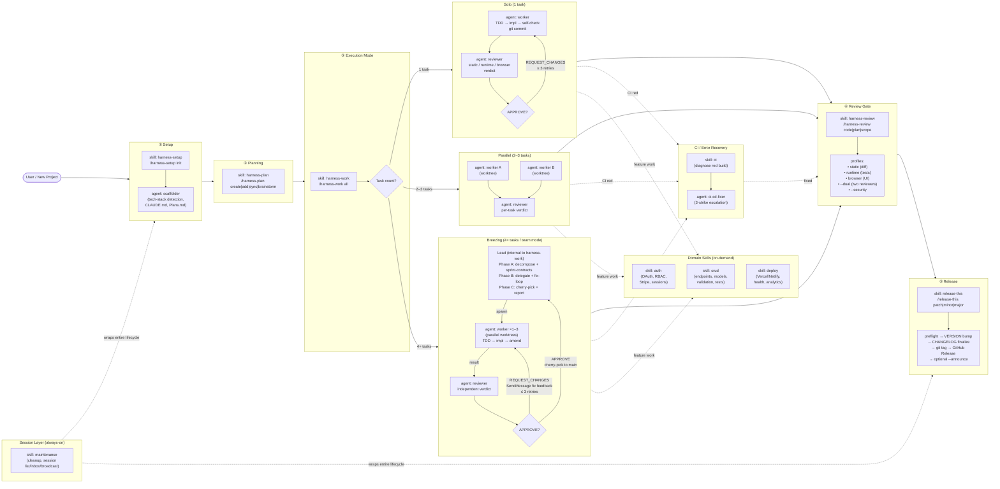
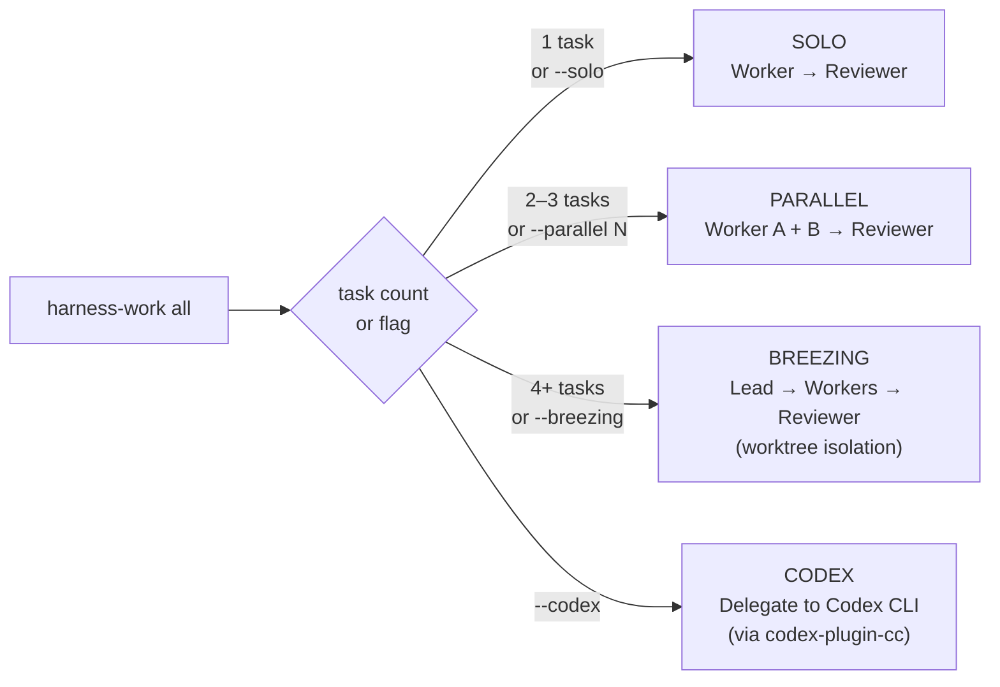
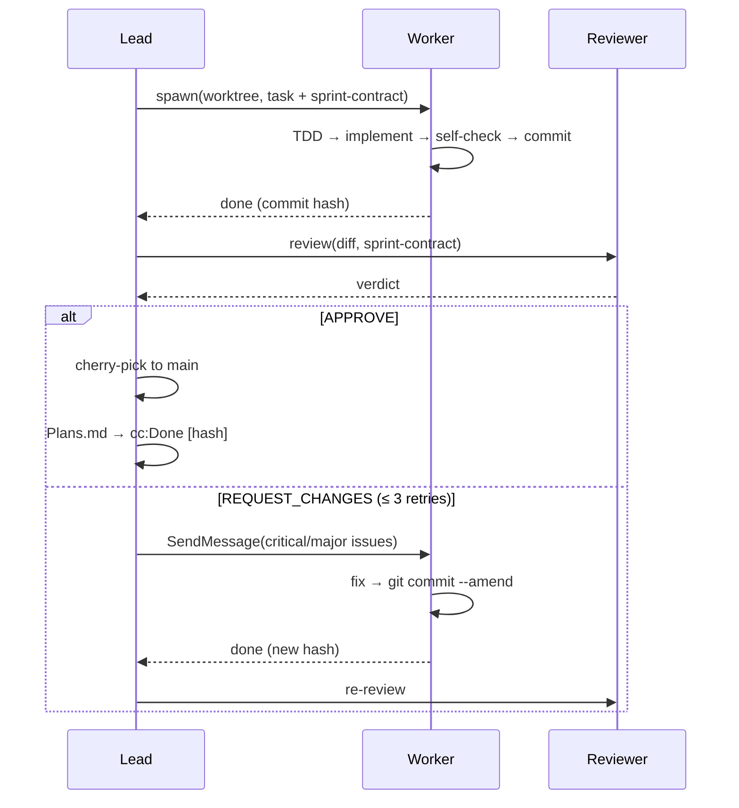
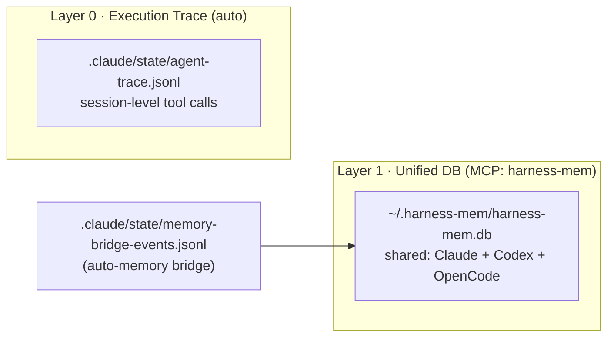

# Harness — Workflow Overview

Full lifecycle of a feature from project init to release, showing which skills and agents are active at each stage.

> **Attribution**: The PII & Secret Guard ships an embedded regex catalog ported from
> [datumbrain/claude-privacy-guard](https://github.com/datumbrain/claude-privacy-guard) (MIT License).
> See [`go/internal/piiguard/data/SOURCE.md`](../go/internal/piiguard/data/SOURCE.md) for details.

---

## Primary Workflow


```mermaid
flowchart LR
    START([User / New Project])

    %% ── SETUP ──────────────────────────────────────────────
    subgraph SETUP["① Setup"]
        direction TB
        HS["skill: harness-setup\n/harness-setup init"]
        SC["agent: scaffolder\n(tech-stack detection,\nCLAUDE.md, Plans.md)"]
        HS --> SC
    end

    %% ── PLANNING ────────────────────────────────────────────
    subgraph PLAN["② Planning"]
        direction TB
        HP["skill: harness-plan\n/harness-plan create|add|sync|brainstorm"]
    end

    %% ── WORK MODE SELECTION ─────────────────────────────────
    subgraph MODE["③ Execution Mode"]
        direction TB
        HW["skill: harness-work\n/harness-work all"]
        DEC{Task count?}
        HW --> DEC
    end

    %% ── SOLO ────────────────────────────────────────────────
    subgraph SOLO["Solo  (1 task)"]
        direction TB
        W1["agent: worker\nTDD → impl → self-check\ngit commit"]
        RV1["agent: reviewer\nstatic / runtime / browser\nverdict"]
        FX1{"APPROVE?"}
        W1 --> RV1 --> FX1
        FX1 -->|REQUEST_CHANGES\n≤ 3 retries| W1
    end

    %% ── PARALLEL ────────────────────────────────────────────
    subgraph PAR["Parallel  (2–3 tasks)"]
        direction TB
        W2A["agent: worker A\n(worktree)"]
        W2B["agent: worker B\n(worktree)"]
        RV2["agent: reviewer\nper-task verdict"]
        W2A & W2B --> RV2
    end

    %% ── BREEZING ────────────────────────────────────────────
    subgraph BREEZING["Breezing  (4+ tasks  /  team mode)"]
        direction TB
        LEAD["Lead (internal to harness-work)\nPhase A: decompose + sprint-contracts\nPhase B: delegate + fix-loop\nPhase C: cherry-pick + report"]
        WW["agent: worker ×1–3\n(parallel worktrees)\nTDD → impl → amend"]
        RVV["agent: reviewer\nindependent verdict"]
        LOOP{"APPROVE?"}
        LEAD -->|spawn| WW
        WW -->|result| RVV
        RVV --> LOOP
        LOOP -->|REQUEST_CHANGES\nSendMessage fix feedback\n≤ 3 retries| WW
        LOOP -->|APPROVE\ncherry-pick to main| LEAD
    end

    %% ── CI RECOVERY ─────────────────────────────────────────
    subgraph CI["CI / Error Recovery"]
        direction TB
        CISKILL["skill: ci\n(diagnose red build)"]
        CIFIXER["agent: ci-cd-fixer\n(3-strike escalation)"]
        CISKILL --> CIFIXER
    end

    %% ── REVIEW ──────────────────────────────────────────────
    subgraph REVIEW["④ Review Gate"]
        direction TB
        HR["skill: harness-review\n/harness-review code|plan|scope"]
        PROFILES["profiles:\n• static (diff)\n• runtime (tests)\n• browser (UI)\n• --dual (two reviewers)\n• --security"]
        HR --> PROFILES
    end

    %% ── RELEASE ─────────────────────────────────────────────
    subgraph RELEASE["⑤ Release"]
        direction TB
        REL["skill: release-this\n/release-this patch|minor|major"]
        STEPS["preflight → VERSION bump\n→ CHANGELOG finalize\n→ git tag → GitHub Release\n→ optional --announce"]
        REL --> STEPS
    end

    %% ── SESSION LAYER (always-on) ───────────────────────────
    subgraph SESSION["Session Layer  (always-on)"]
        direction LR
        SESS["skill: maintenance\n(cleanup, session list/inbox/broadcast)"]
    end

    %% ── DOMAIN SKILLS (on-demand) ───────────────────────────
    subgraph DOMAIN["Domain Skills  (on-demand)"]
        direction TB
        AUTH["skill: auth\n(OAuth, RBAC,\nStripe, sessions)"]
        CRUD["skill: crud\n(endpoints, models,\nvalidation, tests)"]
        DEPLOY["skill: deploy\n(Vercel/Netlify,\nhealth, analytics)"]
    end

    %% ── MAIN FLOW ───────────────────────────────────────────
    START --> SETUP --> PLAN --> MODE

    DEC -->|1 task| SOLO
    DEC -->|2–3 tasks| PAR
    DEC -->|4+ tasks| BREEZING

    SOLO --> REVIEW
    PAR  --> REVIEW
    BREEZING --> REVIEW

    REVIEW --> RELEASE

    %% CI recovery can fire after any work phase
    SOLO    -.->|CI red| CI
    PAR     -.->|CI red| CI
    BREEZING-.->|CI red| CI
    CI      -.->|fixed| REVIEW

    %% Domain and utility are invoked inside work phases
    SOLO -.->|feature work| DOMAIN
    PAR  -.->|feature work| DOMAIN
    BREEZING -.->|feature work| DOMAIN

    %% Session layer runs throughout
    SESSION -.->|wraps entire lifecycle| SETUP
    SESSION -.->|wraps entire lifecycle| RELEASE
```

---

## Execution Mode Decision


```mermaid
flowchart LR
    HW["harness-work all"]
    HW --> D{task count\nor flag}
    D -->|1 task\nor --solo| SOLO["SOLO\nWorker → Reviewer"]
    D -->|2–3 tasks\nor --parallel N| PAR["PARALLEL\nWorker A + B → Reviewer"]
    D -->|4+ tasks\nor --breezing| BR["BREEZING\nLead → Workers → Reviewer\n(worktree isolation)"]
    D -->|--codex| COD["CODEX\nDelegate to Codex CLI\n(via codex-plugin-cc)"]
```

---

## Breezing Fix Loop (most common review cycle)


```mermaid
sequenceDiagram
    participant Lead
    participant Worker
    participant Reviewer

    Lead->>Worker: spawn(worktree, task + sprint-contract)
    Worker->>Worker: TDD → implement → self-check → commit
    Worker-->>Lead: done (commit hash)
    Lead->>Reviewer: review(diff, sprint-contract)
    Reviewer-->>Lead: verdict

    alt APPROVE
        Lead->>Lead: cherry-pick to main
        Lead->>Lead: Plans.md → cc:Done [hash]
    else REQUEST_CHANGES (≤ 3 retries)
        Lead->>Worker: SendMessage(critical/major issues)
        Worker->>Worker: fix → git commit --amend
        Worker-->>Lead: done (new hash)
        Lead->>Reviewer: re-review
    end
```

---

## Memory & Session Architecture


```mermaid
flowchart LR
    subgraph L0["Layer 0 · Execution Trace (auto)"]
        AT[".claude/state/agent-trace.jsonl\nsession-level tool calls"]
    end
    subgraph L1["Layer 1 · Unified DB (MCP: harness-mem)"]
        DB["~/.harness-mem/harness-mem.db\nshared: Claude + Codex + OpenCode"]
    end

    BR[".claude/state/memory-bridge-events.jsonl\n(auto-memory bridge)"] --> DB
```

**L0 trace stream**:
- `agent-trace.jsonl` aggregates all tool calls in a session (session-scoped; see `go/internal/hookhandler/emit_agent_trace.go`)

---

## Skill Catalog by Lifecycle Phase

| Phase | Skill | Trigger |
|-------|-------|---------|
| **Setup** | `harness-setup` | `/harness-setup init` |
| **Planning** | `harness-plan` | `/harness-plan create\|add\|sync\|brainstorm` |
| **Implementation** | `harness-work` | `/harness-work all\|N\|--breezing` |
| **Implementation** | `breezing` | `/breezing all` (alias for team mode) |
| **Implementation** | `auth` | building login / OAuth / payments |
| **Implementation** | `crud` | building data endpoints |
| **Implementation** | `deploy` | shipping to Vercel / Netlify |
| **CI Recovery** | `ci` | red build or "diagnose CI" |
| **Review** | `harness-review` | `/harness-review code\|plan\|scope` |
| **Release** | `release-this` | `/release-this patch\|minor\|major` |
| **Maintenance** | `maintenance` | `/maintenance --all`, session list/inbox/broadcast |

---

## Agent Roles

| Agent | Role | Permissions |
|-------|------|-------------|
| **scaffolder** | Project init, tech-stack detection, state updates | Read / Write / Edit |
| **worker** | TDD, implementation, self-check, git commit | Read / Write / Edit / Bash |
| **reviewer** | Independent verdict against sprint-contract | Read / Grep / Glob only |
| **ci-cd-fixer** | CI failure diagnosis and fix with 3-strike escalation | Read / Write / Edit / Bash |
| **Lead** *(internal)* | Orchestrate phases A→B→C in breezing mode | Spawns Worker + Reviewer |

> See `agents/` for full agent definitions and [hooks/README.md](hooks/README.md) for the hook event map.

---

## Hooks

Hooks are the always-on automation layer — they fire on Claude Code events (PreToolUse, PostToolUse, SessionStart, Stop, etc.) and invoke Go binary handlers or shell scripts without any user action required.

```
Claude Code Event → hooks.json matcher → Go binary (bin/harness) → handler script
```

Key hook groups at a glance:

| Event | What fires |
|-------|-----------|
| **PreToolUse** `Write\|Edit\|MultiEdit\|Bash\|Read` | **PII Guard** (block on credentials/PII), guardrail R01–R13, inbox scan |
| **PostToolUse** `Bash\|Read` | **PII Guard** redaction (inject sanitized `additionalContext` if secrets found in tool output) |
| **PostToolUse** `Write\|Edit\|Task` | Memory bridge, trace, auto-test, quality-pack, plans-watcher |
| **PostToolUse** `Bash` | Commit cleanup, async CI status check |
| **PermissionRequest** | File-modification guard, test/build validation |
| **SessionStart** | Env check, memory bridge init |
| **Stop / SessionEnd** | Session summary, WIP-task gate, memory finalise |
| **UserPromptSubmit** | **PII Guard** (block prompt on credentials/PII), policy injection, command tracking, breezing signal |
| **Pre/PostCompact** | State save, context re-injection |

> **PII Guard (Phase 83)**: three new `bin/harness hook pii-*` subcommands run on UserPromptSubmit (block + exit 1), PreToolUse (`permissionDecision: deny`), and PostToolUse (`additionalContext` with redacted view). 45 active rules from `go/internal/piiguard/`; disable globally with `HARNESS_PIIGUARD_DISABLED=1` or per-rule with `HARNESS_PIIGUARD_DISABLED_RULES=id1,id2`. See the main [README.md](../README.md#pii--secret-guard) for details.

For the full event map and per-hook script references, see **[hooks/README.md](hooks/README.md)**.
