# Harness Hooks — Architecture Overview

How Claude Code events flow through hooks to handler scripts.

## Hook Flow Diagram

```mermaid
flowchart LR
    CC([Claude Code Event])

    CC --> PRE[PreToolUse]
    CC --> POST[PostToolUse]
    CC --> PERM[PermissionRequest]
    CC --> SESSION[SessionStart]
    CC --> STOP[Stop / SessionEnd]
    CC --> UPS[UserPromptSubmit]
    CC --> COMPACT[Pre/PostCompact]
    CC --> WORKTREE[WorktreeCreate/Remove]
    CC --> SUBAGENT[SubagentStart/Stop]
    CC --> TEAM[TaskCompleted / TeammateIdle]
    CC --> REACTIVE[CwdChanged / FileChanged]
    CC --> ELICIT[Elicitation]

    %% PreToolUse
    PRE -->|Write∣Edit∣Bash∣Read| PRE1["hook pre-tool\n→ Go binary guardrails\n(allow / deny / defer)"]
    PRE -->|Write∣Edit| PRE2["hook inbox-check\n→ pretooluse-inbox-check.sh\n(cross-session messages)"]
    PRE -->|Write∣Edit| PRE3["Agent hook\n(scan for hardcoded secrets)"]
    PRE -->|mcp__chrome-devtools__\nmcp__playwright__| PRE4["hook browser-guide\n→ pretooluse-browser-guide.sh"]

    %% PostToolUse
    POST -->|Write∣Edit∣Bash| POST1["hook post-tool\n→ Go binary post-tool handlers"]
    POST -->|*| POST2["hook log-toolname\n→ posttooluse-log-toolname.sh"]
    POST -->|*| POST3["hook memory-bridge\n→ lib/harness-mem-bridge.sh"]
    POST -->|Bash git commit| POST4["hook commit-cleanup\n→ posttooluse-commit-cleanup.sh\n(clear review state)"]
    POST -->|Bash| POST5["hook ci-status ⚡async\n→ ci-status-checker.sh\n(build status check)"]
    POST -->|Skill∣Task∣SlashCommand| POST6["hook usage-tracker\n→ usage-tracker.sh"]
    POST -->|Skill| POST7["hook clear-pending\n→ posttooluse-clear-pending.sh"]
    POST -->|TodoWrite| POST8["hook todo-sync\n→ todo-sync.sh"]
    POST -->|Write∣Edit∣Task| POST_BATCH["Batch hooks"]
    POST_BATCH --> PB1["hook emit-trace\n→ emit-agent-trace.js"]
    POST_BATCH --> PB2["hook auto-cleanup\n→ auto-cleanup-hook.sh"]
    POST_BATCH --> PB3["hook track-changes\n→ track-changes.sh"]
    POST_BATCH --> PB4["hook auto-test ⚡async\n→ auto-test-runner.sh"]
    POST_BATCH --> PB5["hook quality-pack\n→ posttooluse-quality-pack.sh"]
    POST_BATCH --> PB6["hook plans-watcher\n→ plans-watcher.sh"]
    POST_BATCH --> PB7["hook tdd-check\n→ tdd-order-check.sh"]
    POST_BATCH --> PB8["hook auto-broadcast\n→ session-auto-broadcast.sh"]

    %% PermissionRequest
    PERM -->|Edit∣Write∣MultiEdit| PERM1["hook permission\n→ permission.sh → Go binary\n(file modification guard)"]
    PERM -->|Bash test/build cmds| PERM2["hook permission\n→ permission.sh → Go binary\n(test & build validation)"]

    %% SessionStart
    SESSION -->|startup∣resume| SES1["hook session-start\n→ session-init.sh\n→ session-register.sh"]
    SESSION -->|startup∣resume| SES2["hook memory-bridge\n→ lib/harness-mem-bridge.sh\n(startup init)"]

    %% Stop / SessionEnd
    STOP --> STOP1["hook session-summary\n→ session-summary.sh"]
    STOP --> STOP2["hook memory-bridge stop\n→ lib/harness-mem-bridge.sh\n(finalize memory)"]
    STOP --> STOP3["hook stop-evaluator\n→ stop-check-pending.sh\n(check WIP tasks)"]
    STOP --> STOP4["hook session-cleanup\n→ session-cleanup.sh\n(remove temp files)"]
    STOP --> STOP5["Agent hook\n(block if WIP tasks remain)"]

    %% UserPromptSubmit
    UPS --> UPS1["hook inject-policy\n→ userprompt-inject-policy.sh"]
    UPS --> UPS2["hook track-command\n→ userprompt-track-command.sh"]
    UPS --> UPS3["hook memory-bridge user-prompt\n→ lib/harness-mem-bridge.sh"]
    UPS --> UPS4["hook fix-proposal\n→ fix-proposal-injector.sh"]
    UPS --> UPS5["hook breezing-signal\n→ session-broadcast.sh"]

    %% Pre/PostCompact
    COMPACT -->|PreCompact| PC1["hook pre-compact-save\n(save state)"]
    COMPACT -->|PreCompact| PC2["Agent hook\n(warn if WIP tasks exist)"]
    COMPACT -->|PostCompact| PC3["hook post-compact\n(re-inject context)"]

    %% Worktree
    WORKTREE -->|WorktreeCreate| WT1["hook worktree-create\n→ worktree-create.sh"]
    WORKTREE -->|WorktreeRemove| WT2["hook worktree-remove\n→ worktree-remove.sh"]

    %% Subagent
    SUBAGENT -->|SubagentStart| SA1["hook subagent-start\n→ subagent-tracker.sh (register)"]
    SUBAGENT -->|SubagentStop| SA2["hook subagent-stop\n→ subagent-tracker.sh (deregister)"]

    %% Team mode
    TEAM -->|TaskCompleted| TC1["hook task-completed-ext\n→ task-completed.sh\n(timeline entry)"]
    TEAM -->|TeammateIdle| TI1["hook teammate-idle\n(team coordination)"]

    %% Reactive
    REACTIVE -->|Plans.md∣rules∣hooks.json| RE1["hook runtime-reactive\n→ runtime-reactive.sh\n(prompt re-read)"]

    %% Elicitation
    ELICIT -->|Elicitation| EL1["hook elicitation\n→ elicitation-handler.sh\n(auto-skip in breezing mode)"]
    ELICIT -->|ElicitationResult| EL2["hook elicitation-result\n(log result)"]
```

## Hook Implementation Patterns

Three patterns are used across hooks:

| Pattern | Description | Examples |
|---------|-------------|---------|
| **`command`** | shell shim → Go binary → handler script | pre-tool, post-tool, permission |
| **`agent`** | Full LLM judgment call (allow/deny) | secrets scanning, WIP-task blocker |
| **`prompt`** | Lightweight LLM call with schema-validated JSON | elicitation, compact warnings |

The Go binary (`bin/harness`) is the central dispatch router — all thin shell shims in `hooks/` delegate to it, keeping routing logic type-safe in Go rather than scattered across shell scripts.

## Key Event Notes

- **Write/Edit** is the most instrumented event — triggers 10+ hooks across PreToolUse and PostToolUse
- **Stop/SessionEnd** has an agent-level gate that can block session termination if WIP tasks remain
- **UserPromptSubmit** is the entry point for policy injection and breezing worker coordination
- `⚡async` hooks (`ci-status`, `auto-test`) fire-and-forget to avoid blocking Claude's response latency

## Files

| File | Purpose |
|------|---------|
| `hooks.json` | Single source of truth for all hook configuration |
| `pre-tool.sh` | Thin shim → `bin/harness hook pre-tool` |
| `post-tool.sh` | Thin shim → `bin/harness hook post-tool` |
| `permission.sh` | Thin shim → `bin/harness hook permission` |
| `session.sh` | Thin shim → `bin/harness hook session-*` |
| `BEST_PRACTICES.md` | Hook authoring guidelines |

Handler scripts live in `../scripts/hook-handlers/` and utility scripts in `../scripts/`.
